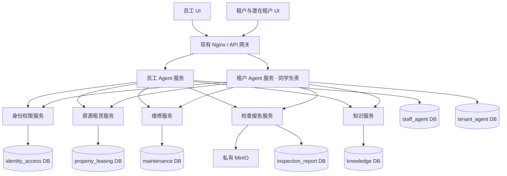

# 员工侧与租户侧的微服务划分

## 决策

设置两个独立体验入口：`staff-agent-service`（本项目）和 `tenant-agent-service`（另一位同学）。共同使用身份、房源租赁、维修、报告、知识五个业务服务。员工侧本身是第六个已设计服务；租户侧是第七个服务，内部实现由同学负责。

服务按业务数据与事务边界拆分，LLM 的分类、提参和回复不是三个微服务。MCP、A2A 都不是必选运行依赖；首次落地用 HTTP API，独立 Agent 承接完整任务时才添加 A2A。



## 数据所有权与开发责任

| 服务 | 拥有的数据 | 责任与边界 |
|---|---|---|
| identity-access | 现有 users；organizations、account_memberships、staff、roles、permissions、staff_roles、role_permissions | 账号、组织身份、员工 RBAC；可信身份签发；潜客注册身份与租客身份分别管理 |
| property-leasing | 房源、员工房源授权范围、主体、业主、租约租客、应收实收核销、申请、预约、收藏 | 双方共享业务事实；员工按管理范围查询，租户按自身租约／申请查询，潜客只看已发布字段 |
| maintenance | 工单、工单事件、草稿、审批 | 员工侧创建模拟草稿；租户侧未来提交自己的报修；审批、状态更新由本服务控制 |
| inspection-report | 现有报告、文件、报告聊天相关九表；检查、发现、报告关联、分析任务与步骤 | 继续运行现有视频/PDF 图；MinIO 元数据归该服务；不因拆服务修改原报告 JSON |
| knowledge | 知识库、角色访问、文档版本 | 公共、租户、员工知识隔离；检索与引用；租户服务不能选择员工库绕过访问控制 |
| staff-agent | 员工会话、请求、意图运行、任务、尝试、调用轨迹、结果、人工案件、Agent/提示词版本、A2A 映射、outbox、审计 | 本项目负责；只编排任务，通过领域 API 操作业务数据 |
| tenant-agent | 租户／潜客会话、消息、意图计划、任务结果、推荐上下文 | 同学负责；不重复建正式房源、租约、维修或报告表 |

“本项目负责”不意味着独自决定所有共享接口；共享 API 和事件需要两人共同确认版本并各自执行契约测试。建议本项目先提供 Mock 服务契约，同学可先用 fixture 联调。

现有 `public.users` 留在身份服务，其他九张旧表留在报告服务。当前旧表指向 users 的外键，在真正物理拆库时必须改为逻辑 user_id；当前不自动删除这些外键、不搬迁数据。报告聊天仍是报告产品的会话，不强行改作租户业务聊天。

## 为什么先保持这些边界

- 租约、应收、实收、核销保持同服务，减少支付对账的分布式事务。接真实支付平台、财务团队独立维护时再拆 billing-service。
- 视频处理 worker 和 HTTP API 可以是同一个报告服务的两个进程，共享同一数据库所有权；worker 不必成为另一业务服务。
- 文件存储先保留在报告服务。知识服务上传文档时调用其文件 API；未来多个团队大量使用时可独立 media-service。
- 人工队列当前归员工侧处理；以后租户投诉也需要统一受理，再单独拆 case-service。
- 查询 Agent 和意图 Agent 保持员工服务内部模块，避免每个模型调用都跨网。

## 服务内代码结构建议

```text
services/<service>/
  api/                  HTTP endpoints 与认证入口
  application/          用例编排、事务边界、业务规则
  domain/               类型、状态转移规则
  infrastructure/       repository、模型或下游 client
  migrations/           本服务 Alembic；禁止跨服务迁移
  contracts/            API / event schema 与 fixture
```

本轮实际创建的是 `design/database_v1/services/*.sql` 数据库骨架，尚未把现有 backend 拆成可部署服务。正式拆分遵循渐进迁移，避免六套空壳服务取代已有可用报告功能。

## 部署阶段

1. **数据库和协议模拟（本轮）**：一库多 schema，离线员工意图原型；共享 API 用契约说明。
2. **先分两个入口**：员工 API 与同学的租户 API 独立进程；现有 backend 暂承载报告，共享领域模块逐个暴露 HTTP。
3. **按需要独立部署共享服务**：每个服务独立用户、连接池、数据库、迁移版本；数据库凭据不对其他服务开放。
4. **持久化异步任务**：视频长任务先加 worker；事件使用 transactional outbox + 消费者幂等，不默认承诺 exactly-once。
5. **可选 A2A**：报告 Agent 独立对外承接任务时增加适配层。远端任务关联 run_id，不取代业务授权或现有串行策略。

本地可以在同一个 PostgreSQL 实例中使用不同数据库。单库 schema 模式只有在分别创建服务角色并限制 GRANT 后才构成访问隔离；当前 DDL 的 schema 划分本身不提供安全隔离。
