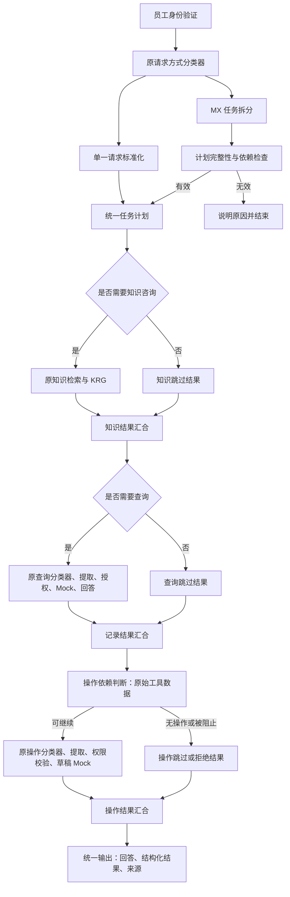

# Safescan Mixed 共用链路 v1

基于用户 2026-09-06 上传的 `Safescan 员工侧 Agent - 意图识别修改.yml` 生成。原始 DSL、知识库正文和旧测试均未覆盖。

## 导入

1. 在 Dify 工作室中通过“导入 DSL 文件”新建应用，选择同目录的 `Safescan 员工侧 Agent - Mixed共用链路.yml`。
2. 确认通义模型插件和模型可用。模型及插件版本沿用原文件，没有替换供应商。
3. 打开原来的“知识检索”节点，确认当前工作空间能识别其中的知识库 ID；跨工作空间导入时重新选择已有 EMP 9 篇员工库。
4. 先运行 CSV 中的单一请求回归，再运行 Mixed；看运行追踪，不只看自然语言回答。
5. 通过后再决定是否发布。此交付没有访问在线 Dify、没有导入或发布应用。

当前应用仍是 Workflow。缺参时结束本次运行，用户需要补全问题后重新运行；没有会话恢复、审批存储或真实写入。

## 设计



原知识、查询、操作节点没有复制成第二套 Mixed 业务流程。Mixed 负责生成任务计划，单一请求也标准化为同一结构。

`request_origin` 最终输出为 `single` 或 `mixed`；内部 `统一子任务上下文.origin` 保存该来源。各业务节点使用独立的 `knowledge_query`、`record_query`、`action_query`，不再使用完整原问题作为子任务输入。

整个图保持无环，按知识 → 查询 → 操作顺序运行。每一阶段的互斥出口用变量聚合器统一为一个字符串；最终代码读取三个已产生的阶段结果。没有用变量聚合器收集同时执行的分支，也没有回连原分类器构成循环。

Dify 官方说明：变量聚合器用于互斥分支，不能合并并行执行的全部结果：
https://github.com/langgenius/dify-docs/blob/main/en/cloud/use-dify/nodes/variable-aggregator.mdx

## 范围与依赖

每次最多一项知识咨询、一项记录查询、一项操作。查询复用原有房源、合同/租金、维修、检查、统计分支；多个记录业务或多个独立操作要求拆分，不静默丢弃部分任务。原有查询参数覆盖面的限制继续存在，例如房源预算、交通条件仍未新增，也没有修改此前暂缓的匹配回答问题。

| 依赖 | 行为 |
|---|---|
| `none` | 独立子任务；每项独立授权。无关查询被拒绝不会自动禁止另一个有权执行的草稿操作 |
| `after_query` | 前置查询必须成功，并唯一返回指定房源的维修工单；否则不进入操作流程 |
| `maintenance_status` | 在上项基础上比较原始 `status` 与指定状态；不使用 LLM 回答作为判断依据 |
| `manual` | 政策合规判断、金额/时间阈值、复合/否定条件、先写后读等暂不自动执行；只读任务可以返回，操作明确要求人工处理 |

自动依赖当前只支持**原始维修工单的单目标判断**。其他领域查询可以回答，但不能直接成为自动执行的条件。多结果、无结果、无权限、未知对象、不支持的条件都会阻止依赖操作。

知识检索的非空结果不等于政策充分，更不等于审批通过。政策驱动的操作不根据 KRG 的自然语言结论放行。

## 权限与数据边界

- 身份沿用 LSC-Code。开始节点选择 staff_id 只是原型身份模拟，不能代替正式 SSO/JWT。
- 当前 EMP 9 篇通用政策的原型白名单为 Amy、Ben、Chloe、David；不是所有内部文档的通用授权规则。
- 每个查询分支沿用原授权节点；房源、合同、租金、检查工具增加可信员工上下文二次校验。
- 维修查询授权改用 LSC 权限和范围，Mock 改为只读；明确检查房源、工单编号、状态、优先级，先范围过滤再匹配工单。
- 统计分支沿用原有独立模拟权限配置（与 LSC 权限命名尚未统一），不扩张原有授权范围。
- 操作继续走已有 MAA-Code 和 MOCK-Maintenance Draft。Mixed 不授予关闭、修改、审批权限。
- 依赖操作在 ERA 提取后再次检查操作房源与查询绑定房源一致；提取失败不执行。
- 查询工具不得创建或修改草稿；所有成功的写类结果仍是 `draft_simulated`，`persisted=false`、`executed=false`、`approval_submitted=false`。

## 输出

- `answer`：单一请求保留原回答文本；Mixed 按政策说明、记录查询、操作结果组合文本。最终不再增加一个 LLM 来改写执行状态。
- `task_results`：JSON 字符串数组，每项有 `kind/status/text/data/executed`。包含真实工具状态用于排错和后端集成；只包含当前已授权的结果。
- `request_origin`：single / mixed。

权限不足、无匹配结果、尚未接入、缺参、条件不满足和模拟成功分别保留状态。模型节点故障保持失败停止，没有把故障默认为无记录或条件满足。

## 已完成的本地验证

`test_workflow.py` 包含 21 个测试方法（部分方法涵盖多身份、多业务场景）：

- YAML 解析、代码节点编译、函数入参与 DSL 绑定一致。
- 所有节点可从开始到达、无悬空引用；构建时验证图无环。
- 使用明确的分类/提取/检索/LLM 占位，沿图执行单一与 Mixed 路径，检查是否引用未运行分支变量。
- 单一七种查询出口、知识有/无证据、草稿允许/拒绝。
- Mixed 知识＋查询、知识＋操作、查询＋操作、三者组合。
- 前置查询无权/空结果/未支持，条件成立/不成立，跨房源，独立任务权限，复杂条件人工处理。
- 高权限操作仍拒绝；只读维修 Mock 拒绝 create/update；原文件 SHA-256 未变化。

**这些测试不包含真实模型分类准确率、真实知识召回质量、Dify 在线引擎或导入兼容性验证。** `manual_testcases.csv` 是待在线执行的验收题，不宣称已在线通过。

## 文件

- `Safescan 员工侧 Agent - Mixed共用链路.yml`：导入文件。
- `节点配置与连线.md`：基于生成 DSL 自动整理的节点配置及连线。
- `manual_testcases.csv`：在线验收题与预期。
- `runtime.py`：新代码节点的纯函数来源。
- `build.py`：从原 DSL 重建导入文件。
- `test_workflow.py`：离线测试。
- `build_manifest.json`：原文件指纹与构建信息。

重建和测试（项目根目录）：

```sh
.venv/bin/python dify/workflows/mixed_action_v1/build.py
.venv/bin/python dify/workflows/mixed_action_v1/test_workflow.py
```
