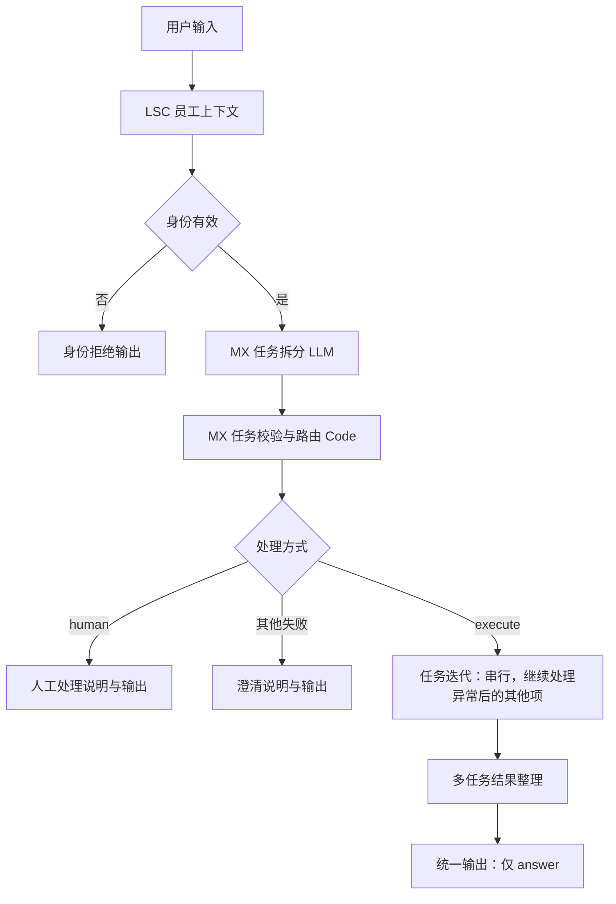

# Safescan 多任务串行与人工分流 v2

基于用户上传的 `Safescan 员工侧 Agent - Internal Knowledge Base (1).yml` 完成结构修改。原上传文件及之前版本未覆盖。

## 导入文件

`Safescan 员工侧 Agent - 多任务串行与人工分流 v2.yml`

在 Dify 工作室导入为**新 Workflow 应用**，确认通义插件和当前模型可用，并检查“知识检索”节点仍绑定 EMP 9 篇资料的知识库。跨工作空间导入时需重新选择知识库；模型、插件、原查询数据和权限配置沿用来源 DSL。

本次未连接在线 Dify，没有导入、发布或运行真实模型。

## 处理规则

| 输入 | 行为 |
|---|---|
| 单项知识或记录查询 | 一次迭代，走原处理与权限链 |
| 单项操作 | 一次迭代，走原操作权限链；仅模拟草稿 |
| 多项独立知识/记录任务 | 串行迭代，每项独立授权、返回结果，最后按原任务顺序整理 |
| 多任务且包含任何操作（包括创建草稿） | 整单人工处理说明；不运行任何查询、知识检索或操作子任务 |
| 依赖前置结果或带有待判断条件的其他任务 | 明确要求先查后再提出请求；不伪装成已支持跨任务结果传递 |
| 超过 10 项 | 要求分批，不静默截断 |
| 格式无效、任务漏覆盖、类型不明、未解析文字 | 澄清后再处理 |

人工分支没有连接受理队列，因此只说明“需要人工处理、尚未提交人工工单”，不声称已转交。

## 新架构



迭代内部复用原有 79 个节点（包含迭代起点及新结果封装），每轮只接收一项任务：

`统一子任务上下文 → 原知识/查询/操作链及各阶段互斥汇合 → 统一结果汇总 → 单任务结果封装`

- 原一级“请求方式分类器”及旧 Mixed 固定字段入口已从新 DSL 移除。所有请求都先拆分，同类型多项查询不再绕过拆分。
- `统一子任务上下文` 从迭代 `item` 读取任务，只为当前类型填充一个问题字段。
- 内部仍使用 `origin=single`，意思是本轮只处理一项，不是原请求只有一项。
- 业务节点引用本轮 `knowledge_query/record_query/action_query`，身份仍来自外层 LSC。
- 内部变量聚合器仅汇合当前轮的互斥路径；迭代节点收集全部轮次。
- 异常轮次保留空位置，外层按 task_id 整理并明确提示缺失结果，不静默删掉失败任务。
- 最终 End 只返回 `answer`，不展示 tool_result、task_results 或来源字段。

## 权限与现有能力

原查询和操作授权节点保留；维修查询工具仍只读。单项操作仍只支持模拟创建维修草稿，高权限修改、关闭、审批不因新调度器而获得授权。

开始节点选择 staff_id 只用于模拟身份，不能代替正式认证；将来应由服务端可信会话传入身份，并由真实工具接口独立授权。

旧 Mock 的业务字段覆盖、统计配置及固定日期沿用原文件。本次没有补充房源预算/通勤筛选，没有扩张知识库范围，也没有实现审批或持久化。

由于拆分采用原文摘录，不明确的共享目标、指代或省略应被澄清。在线验收先使用每项明确写出目标的题目，再测试省略/指代，不能只看格式成功就认定语义完整。

## 验证

25 个离线测试方法通过，部分包含多身份、多业务子场景：

- 原文件 SHA-256 不变；代码编译、变量绑定与函数签名匹配。
- 节点引用、可达性、无环、迭代 parentId/iteration_id/start_node_id/output_selector 与容器边界。
- 单一查询七种业务出口、知识无结果、单项草稿授权/拒绝。
- 三项查询、一查询加两项知识、每轮重新初始化变量，拒绝不会污染后续轮次。
- 多查询加操作、知识加操作、多操作整单人工分支，工具零调用。
- 权限不足、空结果、异常轮次继续、10/11 项上限、依赖澄清。
- 最终只返回回答，不附加调试 JSON。

分类器、参数提取、知识召回和 LLM 在离线测试中使用明确的占位结果。**离线图执行器不是 Dify 引擎**；导入兼容性、模型拆分准确率及知识召回质量仍需在线验证。

迭代节点字段参考 Dify 官方实现：

- https://github.com/langgenius/dify/blob/1.9.2/api/core/workflow/nodes/iteration/entities.py
- https://github.com/langgenius/dify/blob/1.9.2/api/core/workflow/nodes/iteration/iteration_node.py

## 在线验收

建议先跑同目录 `在线验收用例.md`。重点查看任务列表、每轮输入、权限节点结果、实际工具是否运行、输出任务是否齐全。

本版默认关闭并行。串行验证稳定后，只对独立只读任务考虑开启并行并设置并发上限；有结果依赖的任务不应直接开启并行。

## 重建与复测

从项目根目录执行：

```sh
.venv/bin/python dify/workflows/task_iteration_v2/build.py
.venv/bin/python dify/workflows/task_iteration_v2/test_workflow.py
```

`build_manifest.json` 保存输入文件指纹和图规模；`validation_report.json` 保存验证范围。原版本构建与测试保留在 `mixed_action_v1` 中。

空白匹配修复：原文匹配容忍换行、空格和制表符差异，成功后恢复原文片段；数字、标点和文字仍须一致。单节点替换代码见 `MX-任务校验与路由.py`。
