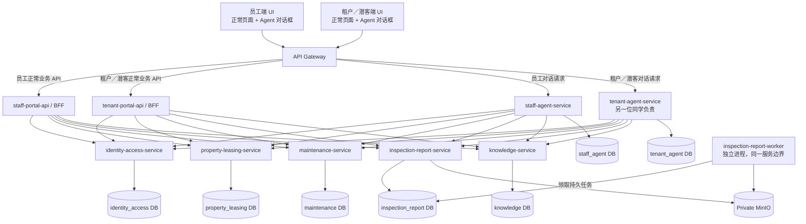
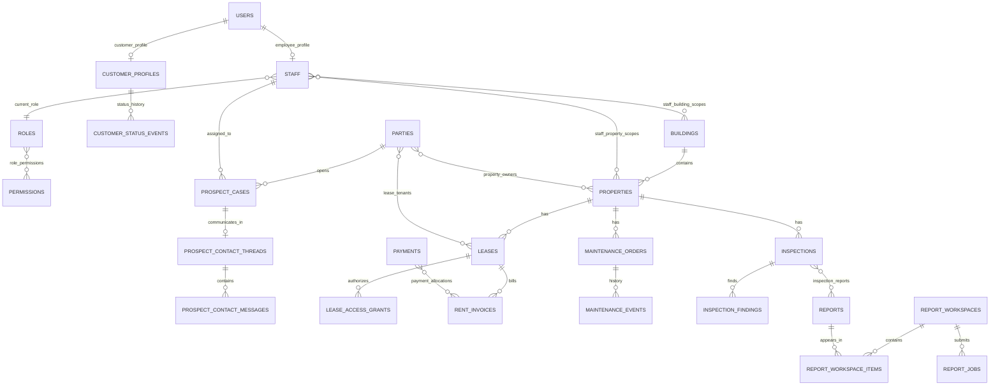
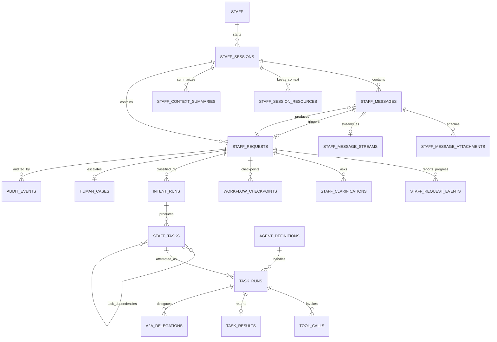
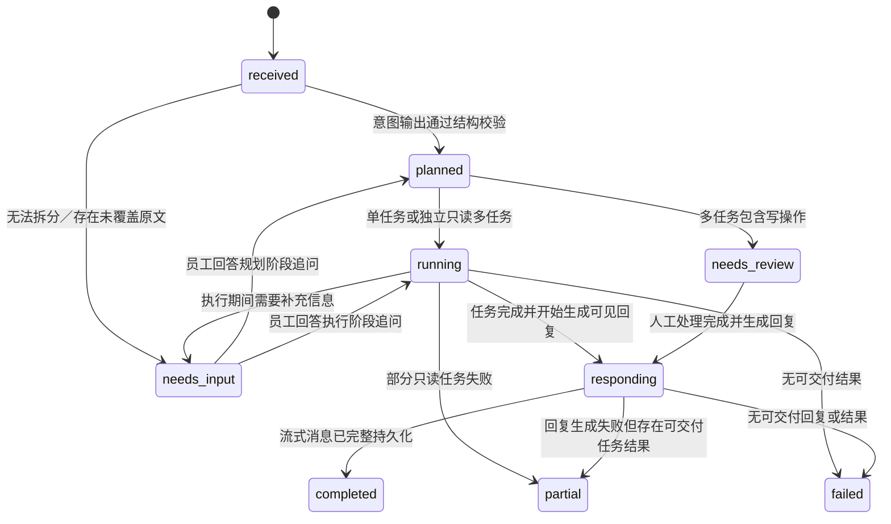
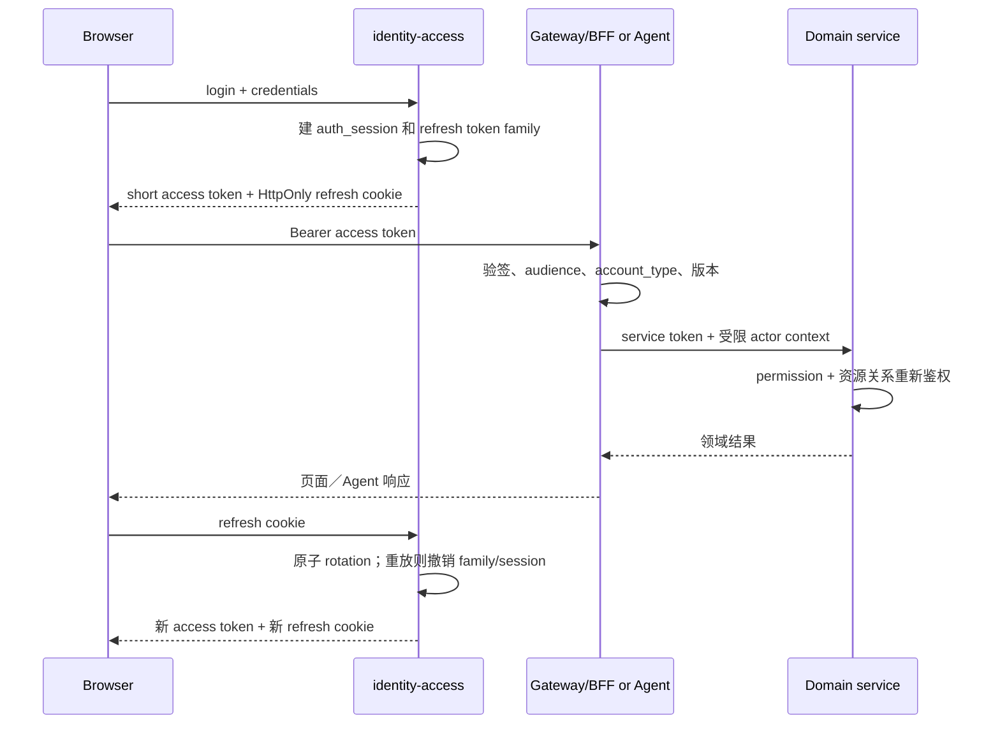
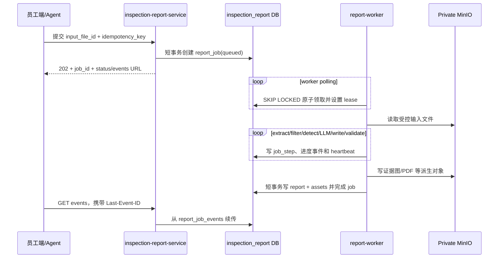

# Safescan 全项目数据库框架设计

> 版本：v1.3（单公司身份、RBAC 与令牌简化稿）
>
> 日期：2026-09-07
>
> 状态：用于首阶段直接重构；本分支已建立六个服务 schema 的 Alembic 基线、核心约束与初始化数据，并已将现有登录、报告仓储、文件仓储和 LangGraph 报告任务切换到新 schema。其余服务拆分、真实 Agent、人工队列和业务 API 按第 14 节继续实施。

## 1. 目标与设计范围

本设计覆盖 Safescan 房屋租赁业务的共享领域数据、员工侧 Agent 数据，以及现有视频检查／报告数据，并为另一位同学负责的租户／潜在租户侧预留清晰边界。

本轮覆盖数据库边界、服务通信规则和异步任务规则，并实现现有登录与 LangGraph 报告链路所需的 API／worker 持久化；不包含 A2A 网络实现或生产数据迁移。当前项目没有生产存量数据和灰度发布要求，实施时直接建立目标 schema、服务边界和新迁移，不设计双写、兼容读或灰度切流。

设计依据包括：

- 当前项目使用 PostgreSQL 17、SQLAlchemy 2、Alembic 和 MinIO；
- 当前十表模型中 `users`、通用聊天数据和报告数据仍在同一数据库，下一阶段直接按服务所有权重构；
- 当前视频报告在 FastAPI 请求进程中通过线程、进程内队列和 Semaphore 执行，进程重启后不能可靠恢复；
- 当前员工侧 Dify 工作流先拆分全部请求，再按任务类型路由；
- 独立只读多任务按原顺序串行处理；
- 多任务中只要包含写操作，整单进入人工处理，不能先执行部分子任务；
- 当前写操作只生成 Mock 草稿，不写正式业务表，也未接入真实人工队列；
- 未来增加记录查询 Agent、知识问答 Agent、操作 Agent，并可通过 A2A 委派任务。
- 当前系统只服务一家公司，不建公司／成员关系层；每个邮箱唯一对应一个用户账号，每个账号固定属于员工侧或客户侧。

### 1.1 明确不做的内容

- 不替另一位同学实现租户／潜在租户 Agent 的内部逻辑；
- 不让员工 Agent 或租户 Agent 各自复制房源、租约、账单、维修等业务真相；
- 不把 LLM 输出文本当作授权结论、执行成功证明或业务状态；
- 不在数据库保存模型隐藏推理过程、明文密钥、访问令牌或未脱敏工具参数；
- 不依靠跨微服务数据库外键实现一致性。

## 2. 总体架构决策

### 2.1 微服务和数据库所有权

生产环境中，每个拥有持久业务状态的领域服务和 Agent 服务采用独立数据库、独立迁移、独立账号。开发和联调阶段可以使用同一 PostgreSQL 实例中的多个 schema 模拟，但 schema 只是部署便利，不等同于服务隔离。面向前端的普通业务 API／BFF 是无状态接入层，不拥有或复制领域数据。



图中存在两条并行入口：正常页面通过 `staff-portal-api`／`tenant-portal-api` 调用确定性的领域 API；两个对话框分别通过员工 Agent／租户 Agent 理解自然语言并编排同一组领域 API。Agent 是平台的智能交互与代办能力，不是正常业务功能访问领域服务的必经层。Portal API／BFF 首期可以是现有后端中的逻辑模块，只有在团队或独立发布需求明确后才物理拆分。

| 微服务 | 数据库／本地 schema | 核心职责 | 开发归属 |
|---|---|---|---|
| `staff-portal-api`／BFF | 无独立业务库 | 员工正常页面的确定性业务 API、接口聚合和响应投影 | 本项目／共享应用层 |
| `tenant-portal-api`／BFF | 无独立业务库 | 租户／潜客正常页面的确定性业务 API、接口聚合和响应投影 | 另一位同学／共享应用层 |
| `identity-access-service` | `identity_access` | 单公司账号、员工、客户状态、角色、权限与令牌 | 共享领域 |
| `property-leasing-service` | `property_leasing` | 房源、主体、租约、租金、申请、预约 | 共享领域 |
| `maintenance-service` | `maintenance` | 正式维修工单、工单事件、操作草稿、审批 | 共享领域 |
| `inspection-report-service` | `inspection_report` | 检查、发现、视频分析任务、报告和文件 | 共享领域／现有项目 |
| `inspection-report-worker` | 复用 `inspection_report` | 独立领取视频分析、PDF 和清理任务；不是新的数据所有者 | 共享领域／现有项目 |
| `knowledge-service` | `knowledge` | 知识库、ACL、文档版本、检索来源 | 共享领域 |
| `staff-agent-service` | `staff_agent` | 员工会话、请求拆分、意图、任务运行、人工分流、A2A、审计 | 本项目 |
| `tenant-agent-service` | `tenant_agent` | 租户／潜客会话、请求、推荐上下文 | 另一位同学 |

### 2.2 服务拆分原则

1. **业务能力拥有数据**：表属于产生和维护业务状态的服务，而不是调用该数据的 Agent。
2. **普通业务与 Agent 并行接入**：正常页面通过 Portal API／BFF 调用领域服务；对话框通过 Agent 编排同一组领域服务，任何一方都不能复制领域业务真相。
3. **Agent 是编排者**：员工 Agent 只保存会话、任务、运行和审计；正式工单仍由维修服务保存。
4. **服务内强一致、服务间最终一致**：服务内用事务和外键；服务间通过 API、事件、幂等键和 outbox 协作。
5. **员工侧和租户侧分库**：两侧不共享会话、Prompt、意图运行或任务运行表，只共享领域服务契约。
6. **直接建立目标边界**：首阶段直接重构代码和 schema 所有权，不保留旧表双写或兼容路径；本地可在一个 PostgreSQL 实例用多 schema 部署，但服务只能通过 API 访问其他 schema 的数据。

## 3. PostgreSQL 统一建模规范

当前系统为单公司模型，所有业务表都不设置 `organization_id`。新增表默认包含以下公共字段：

| 字段 | 类型 | 规则 |
|---|---|---|
| `id` | `bigint generated always as identity` | 主键；内部使用 |
| `created_at` | `timestamptz not null default now()` | 创建时间 |
| `updated_at` | `timestamptz` | 对会被更新的聚合根必设，由应用或触发器维护 |

其他规范：

- 对外暴露不可枚举的 UUID／签名 ID，不直接暴露连续 bigint；
- 金额使用 `numeric(14,2)`，币种使用 ISO 4217 三位码；
- 业务日期使用 `date`，时间点使用 `timestamptz`；
- 状态使用 `text + check`，便于迁移和跨语言契约；
- 灵活元数据可用 `jsonb`，但授权关系、状态、金额和常用过滤字段必须结构化；
- 唯一约束直接围绕业务键建立，例如 users.email、properties.reference、leases.reference；不再人为加入公司维度；
- 跨服务 ID 仅为逻辑引用，不建物理外键，由领域 API 校验；
- 所有外键列必须有索引；高频查询采用“等值列在前、范围／排序列在后”的组合索引；
- 大列表使用 `(created_at, id)` 或业务排序字段的游标分页，不使用深分页 `OFFSET`；
- 审计、调用轨迹和 outbox 达到约一亿行前不提前分区；达到阈值后按月对 `created_at` 范围分区。

## 4. 核心数据关系

### 4.1 共享业务关系



### 4.2 员工 Agent 运行关系



## 5. 各服务表结构设计

下面的字段列表省略第 3 节定义的公共字段。`FK` 仅表示同一服务数据库内的物理外键；`REF` 表示跨服务逻辑引用。

### 5.1 身份与权限服务 `identity_access`

| 表 | 主要字段 | 关系与关键约束 |
|---|---|---|
| `users` | `public_id uuid`, `email`, `account_type`, `username`, `avatar`, `status`, `email_verified_at?`, `auth_version`, `created_at`, `updated_at` | 系统唯一账号；`account_type in (staff,customer)`；`status in (pending,active,suspended,deleted)`；`lower(trim(email))` 全局唯一且激活后不可自行改成另一邮箱；不同邮箱就是不同用户；public_id 仅作为安全的跨服务 subject |
| `user_credentials` | `user_id`, `credential_type`, `secret_hash`, `algorithm`, `changed_at`, `failed_attempts`, `locked_until?`, `status` | FK → users；首期 `credential_type=password`、`status in (active,revoked)`；唯一 user＋credential_type；改密更新当前哈希并另写 auth_event，不保留历史密码哈希 |
| `staff` | `public_id uuid`, `user_id`, `role_id`, `staff_code`, `display_name`, `employment_status`, `hired_at?`, `ended_at?` | FK → users/roles；user_id、public_id、staff_code 均唯一；user.account_type 必须是 staff；`employment_status in (pending,active,on_leave,ended)`；一个员工只有一个当前角色 |
| `staff_role_history` | `staff_id`, `from_role_id?`, `to_role_id`, `changed_by_staff_id`, `reason?`, `effective_at` | FK → staff/roles；只追加；记录岗位变更，当前事实仍以 staff.role_id 为准 |
| `roles` | `public_id uuid`, `code`, `name`, `status`, `version` | public_id、code 全局唯一；固定初始化 `leasing_consultant/property_manager/maintainer/manager_admin` 四个系统角色；code 不允许改名或删除；permission 变化递增 version |
| `permissions` | `code`, `description`, `risk_level` | code 全局唯一；权限粒度使用“资源:动作[_范围]”，不使用模糊的全局 read/write |
| `role_permissions` | `role_id`, `permission_id` | FK → roles/permissions；唯一 role＋permission |
| `customer_profiles` | `user_id`, `customer_status`, `status_version`, `first_prospect_at`, `tenant_since?`, `former_tenant_at?`, `updated_at` | FK → users；user_id 唯一且 user.account_type 必须是 customer；`customer_status in (prospect,tenant,former_tenant)`；表示客户当前最高业务阶段，不表示某一份租约 |
| `customer_status_events` | `customer_id`, `from_status?`, `to_status`, `reason_code`, `effective_at`, `source_event_id?`, `actor_subject_id?`, `details_redacted jsonb` | FK → customer profile；只追加；source_event_id 非空时唯一，保证租赁事件消费幂等；用于还原潜客→租客→历史租客变化 |
| `auth_sessions` | `public_id uuid`, `user_id`, `device_label?`, `user_agent_hash?`, `ip_hash?`, `status`, `last_seen_at`, `expires_at`, `revoked_at?`, `revoke_reason?` | FK → users；登录设备会话真相；`status in (active,revoked,expired)`；不保存公司或身份选择；一个 session 可轮换多个 refresh token |
| `refresh_tokens` | `session_id`, `family_id uuid`, `token_hash`, `parent_token_id?`, `status`, `issued_at`, `used_at?`, `expires_at`, `replaced_by_token_id?` | FK → auth_session/self；`token_hash` 唯一；`status in (active,rotated,revoked,reused,expired)`；只存随机 opaque token 的哈希；每次刷新必须轮换并检测重放 |
| `guest_sessions` | `public_id uuid`, `status`, `expires_at`, `claimed_by_user_id?`, `claimed_at?` | `status in (active,claimed,expired,revoked)`；匿名潜客短期身份；只能访问公开房源／公共知识；tenant Agent 单向引用该 public_id；认领到注册账号时由服务端校验 |
| `service_clients` | `client_code`, `credential_ref`, `allowed_audiences`, `allowed_scopes`, `status`, `key_id?` | 服务机器身份；密钥保存在密钥系统，表中只存引用与公开元数据；不能绑定员工角色 |
| `auth_events` | `user_id?`, `session_id?`, `event_type`, `occurred_at`, `ip_hash?`, `user_agent_hash?`, `correlation_id`, `details_redacted jsonb` | 登录成功／失败、刷新、退出、重放检测、员工角色与客户状态变更的只追加安全审计 |

`users` 是唯一登录身份，邮箱是账号唯一事实来源；`account_type` 决定进入员工端还是客户／租客端，登录后没有额外身份选择。staff 账号必须且只能关联一条 staff；customer 账号必须且只能关联一条 customer_profile，服务层和约束测试保证两类资料互斥。首阶段不支持一个账号同时作为员工和客户；确有此需求时使用不同邮箱建立不同用户，不为这个未发生的场景增加中间身份关系表。

客户只有一个当前状态：注册客户默认为 prospect；至少一份租约 executed/active 时为 tenant；没有有效租约但保留历史访问权时为 former_tenant。tenant 和 former_tenant 仍可查看公开房源、联系业务员并发起新的 prospect case，因此不需要同时持有第二个 prospect 身份。新密码使用 Argon2id 等内存硬哈希，salt 保存在编码后的 hash 中，数据库不保存可解密密码。

#### 5.1.1 员工 RBAC 基线

每个员工只有一个当前角色，四个 code 表示四类岗位。权限仍显式绑定 permission，不依靠数字等级自动继承；`manager_admin` 拥有公司内最高管理权限，但不能绕过租约状态、金额核销和审批等领域约束。

| 角色 | 默认职责范围 | 基线 permission 示例 | 资源过滤规则 |
|---|---|---|---|
| `leasing_consultant` | 空置／可出租房源、潜客接洽、看房、申请、谈判、合同准备与签约 | `property:read_market`、`property:manage_vacancy`、`prospect:manage`、`viewing:manage`、`application:manage`、`lease:prepare`、`lease:execute` | 可读取公司的 market/vacant/under_offer 房源及自己或团队分配的 prospect case；已出租房源只返回最小占用状态，不默认开放履约期合同、维修和租客隐私 |
| `property_manager` | 自己负责大楼／房源的在租合同、租客履约、维修协调、检查与视频报告 | `building:read_assigned`、`property:manage_assigned`、`lease:manage_active_assigned`、`maintenance:create_assigned`、`maintenance:assign_assigned`、`inspection:manage_assigned`、`report:manage_assigned` | 必须命中有效 `staff_building_scopes` 或例外 `staff_property_scopes`；不能因为知道 ID 就访问其他大楼 |
| `maintainer` | 接收并处理分配给自己的维修工单，填写进度、说明和证据 | `work_order:read_assigned`、`work_order:update_assigned`、`work_order:evidence_write`、`property:read_work_context`、`report:read_work_context` | 主要按 `maintenance_orders.assigned_staff_id` 过滤；仅投影完成该工单所需的房源、联系人和报告片段，不开放租约金额、全量租客资料或其他工单 |
| `manager_admin` | 公司员工、角色、权限、资源分配和全部业务的最高管理 | `iam:manage`、`rbac:manage`、`scope:manage`，并显式绑定全部业务权限 | 高风险变更仍写审计、校验版本和幂等键，不能通过 admin 身份伪造领域状态 |

员工授权结果为三个条件的交集：`有效 staff 账号` ∩ `当前角色 permission` ∩ `资源关系`。leasing consultant 对市场／空置房源的公司级访问是角色策略；property manager 以大楼 scope 为主、房源 scope 为例外；maintainer 以已分配工单为主。

建库时 seed 四个系统角色及基线 permission；首位 `manager_admin` 通过受控初始化流程创建，之后只有 active manager_admin 可以更改员工角色。服务必须阻止停用公司最后一个 active manager_admin。角色、permission 或资源 scope 变更均记录操作者、前后版本和 auth event，并递增 user auth_version 或 role.version。

#### 5.1.2 登录会话与令牌持久化原则

`auth_sessions` 保存“用户在哪台设备建立了什么登录会话”，`staff_agent.staff_sessions` 保存“员工与 Agent 的业务对话”，两者不是同一 session。退出、封禁、离职或 refresh token 重放会关闭 auth session，但不会删除 Agent 历史会话。

现有注册、登录、资料更新、密码校验和 token 签发逻辑全部迁入 `identity-access-service`。其他服务只接受身份服务签发的 subject／service credential，不再查询或维护 users。原 password 字段迁入 `user_credentials.secret_hash`，原 storage_uuid 不再承担用户身份和对象路径双重职责；文件 object key 由报告服务独立生成。

员工入职时，manager admin 创建 `account_type=staff` 的 user、staff 档案并直接指定四种角色之一；账号未激活前不能签发 staff token。岗位调整在一个短事务更新 staff.role_id、写 staff_role_history、递增 users.auth_version 并撤销现有 auth sessions。离职时结束 employment、暂停 user 并撤销全部登录 session。

### 5.2 房源与租赁服务 `property_leasing`

| 表 | 主要字段 | 关系与关键约束 |
|---|---|---|
| `buildings` | `public_id uuid`, `reference`, `name`, `address`, `status`, `attributes jsonb` | reference 全局唯一；大楼是 property manager 的主要资源授权边界 |
| `properties` | `public_id uuid`, `building_id?`, `reference`, `address`, `bedrooms`, `bathrooms`, `weekly_rent`, `currency`, `status`, `listing_visibility`, `attributes jsonb` | FK → buildings；reference 全局唯一；`status in (draft,vacant,marketing,under_offer,occupied,maintenance,inactive)`；公开查询只返回已发布投影 |
| `staff_building_scopes` | `staff_id`, `building_id`, `scope_role`, `valid_from`, `valid_until?`, `assigned_by_subject_id` | FK → buildings；REF → identity staff；`scope_role in (primary_manager,support_manager,maintenance_support)`；唯一员工＋大楼＋scope_role＋valid_from；有效期合法 |
| `staff_property_scopes` | `staff_id`, `property_id`, `access_level`, `source`, `valid_from`, `valid_until?`, `assigned_by_subject_id` | FK → properties；REF → identity staff；作为跨大楼临时授权或例外；`access_level in (read,manage)`；不能替代岗位 permission |
| `parties` | `public_id uuid`, `party_type`, `subject_id?`, `name`, `contact jsonb`, `status` | `party_type in (person,company)`；subject_id REF → identity user，非空时全局唯一；一个客户主体只建一条，不因潜客转租客而复制；其潜客／租客角色直接由 prospect case 和 lease 关系判断 |
| `property_owners` | `property_id`, `party_id`, `share` | FK → `properties`,`parties`；唯一房源＋业主；`0 < share <= 1` |
| `prospect_cases` | `public_id uuid`, `prospect_party_id`, `assigned_consultant_staff_id?`, `stage`, `status`, `opened_at`, `converted_lease_id?`, `converted_at?`, `closed_at?`, `version` | FK → parties；REF → staff；`stage in (new,contacted,viewing,application,negotiation,converted,lost)`；每个案件有当前负责业务员和乐观锁 |
| `prospect_case_events` | `prospect_case_id`, `sequence_no`, `event_type`, `from_stage?`, `to_stage?`, `actor_subject_id?`, `occurred_at`, `details_redacted jsonb` | FK → prospect_cases；唯一 case＋sequence；只追加；保存联系、改派、预约、申请与转化轨迹 |
| `prospect_contact_threads` | `prospect_case_id`, `assigned_consultant_staff_id`, `status`, `last_message_at`, `next_sequence` | FK → prospect_cases；REF → staff；每个 case 最多一个 active 联系线程；这是潜客与真人业务员的业务沟通，不复用 tenant Agent 对话 |
| `prospect_contact_messages` | `thread_id`, `sequence_no`, `sender_type`, `sender_subject_id?`, `sender_staff_id?`, `content`, `status`, `sent_at`, `client_message_id?` | FK → thread；sender 在 prospect/staff 中二选一且 ID 匹配；唯一 thread＋sequence；client_message_id 防客户端重发；只允许案件当事潜客与当前／授权业务员读取 |
| `leases` | `public_id uuid`, `property_id`, `reference`, `starts_on`, `ends_on`, `weekly_rent`, `currency`, `status`, `tenant_signed_at?`, `company_signed_at?`, `executed_at?`, `ended_at?`, `version` | FK → properties；租约号唯一；`status in (draft,pending_signature,executed,active,ended,terminated,cancelled)`；结束日期不早于开始日期；只有双方签署完成才能设置 executed_at |
| `lease_tenants` | `lease_id`, `party_id`, `signing_status`, `signed_at?` | FK → leases/parties；支持联合承租；唯一租约＋主体；`signing_status in (pending,signed,declined,waived)`；signed 必须有 signed_at，其他状态不得伪造签署时间；所有必签租客完成后才满足租客侧执行条件 |
| `lease_access_grants` | `lease_id`, `party_id`, `subject_id`, `access_mode`, `status`, `effective_from`, `effective_until?`, `source_event_id`, `version` | FK → leases/parties；subject REF → identity user；`access_mode in (full,read_only)`；唯一租约＋subject；由租约状态产生，是租客读取合同、账单、工单和报告的领域授权真相 |
| `rent_invoices` | `lease_id`, `reference`, `due_on`, `period_start`, `period_end`, `amount`, `currency`, `status` | FK → `leases`；账单号唯一；金额非负；逾期由到期日与未核销余额计算 |
| `payments` | `reference`, `received_at`, `amount`, `currency`, `provider_reference?` | 支付参考号唯一；金额大于 0；退款未来使用反向流水，不覆盖原收款 |
| `payment_allocations` | `payment_id`, `invoice_id`, `amount` | FK → `payments`,`rent_invoices`；唯一支付＋账单；服务层校验核销总额和币种 |
| `tenancy_applications` | `prospect_case_id`, `property_id`, `applicant_id`, `reference`, `status`, `submitted_at?`, `decided_at?`, `version` | FK → case/properties/parties；申请号唯一；申请归入潜客案件；乐观锁 version > 0 |
| `viewing_appointments` | `property_id`, `prospect_id`, `host_staff_id?`, `starts_at`, `ends_at`, `status`, `idempotency_key` | FK → `properties`,`parties`；REF → `staff`；结束时间晚于开始时间；幂等键唯一 |
| `property_favorites` | `party_id`, `property_id` | FK → `parties`,`properties`；唯一主体＋房源 |

房源、租约、应收、实收和核销暂不继续拆分，避免支付和租约状态产生不必要的分布式事务。若未来账务团队独立，再拆出 billing service。

业务员房源列表不只读取一个可被手工改错的 status：`occupied` 由当前 active lease 验证，`under_offer` 由有效申请／谈判案件验证，`vacant/marketing` 必须不存在时间重叠的 active lease。首期由 property-leasing 在同一事务维护 property 状态及相关业务记录，并提供聚合查询投影：房源基本信息、可租日期、当前租期范围、是否已有流程、负责业务员和案件阶段。未分配给当前业务员的案件只显示流程占用与员工信息，不返回潜客联系方式等隐私。

潜客从正常页面联系真人业务员时写 `prospect_contact_messages`；与租户 Agent 的问答仍写 tenant Agent DB。案件改派必须在同一事务更新 case 与 active contact thread 的 assigned consultant，并写 `prospect_case_events(event_type=consultant_reassigned)`，旧业务员随后不再具备消息读取权，除非团队 permission 明确允许。

`leases.tenant_signed_at` 表示全部必需租客签署完成的时间，而不是任一租客的签署时间；逐人时间以 `lease_tenants.signed_at` 为准。`executed_at` 必须不早于 tenant/company 两侧签署完成时间。创建或执行新租约时锁定 property 聚合并检查日期范围，禁止同一房源存在时间重叠的 executed/active 租约。

#### 5.2.1 客户状态：潜客到租客

客户状态由租赁业务事实触发，不允许前端直接把 `customer_status` 从 prospect 改成 tenant：

1. **匿名浏览**：创建短期 `guest_sessions`，只签发公共权限；可以查看已发布房源和公共知识，但不能读取任何潜客档案或租客数据。
2. **注册为潜客**：客户用唯一邮箱注册后，identity 在同一事务创建 `users(account_type=customer)` 和 `customer_profiles(customer_status=prospect)`。业务员也可以先创建只有联系方式的 party 与 prospect case，但没有 user 的 CRM lead 不能登录。客户日后注册时由服务端验证邮箱／联系方式后绑定 subject；匿名会话认领只迁移允许保留的对话和收藏引用。
3. **准备与签署合同**：leasing consultant 可推进 draft、pending_signature 和双方签署；签名时间分别写 `lease_tenants.signed_at`、`leases.tenant_signed_at/company_signed_at`，不能仅靠 status 代替法律时间点。
4. **成为租客**：最后一个必需签名通过、使用租客端的承租 party 已绑定 customer user，并由有 `lease:execute` 权限的员工确认后，property-leasing 在一个事务设置 lease=executed、创建 active/full lease_access_grant、转化 prospect case，并写 `lease.executed` outbox。identity 幂等消费后把 customer_profile 改为 tenant、递增 status_version 与 user.auth_version；lease 到 starts_on 时再变为 active。
5. **退租／终止**：租约 ended/terminated 时 full grant 切换为 read_only，使客户在保留期内仍可查看历史合同／账单。只有在该客户没有其他 executed/active lease 时，identity 才把 customer_status 改为 former_tenant；历史访问权最终以 lease_access_grants 为准。
6. **再次租房**：tenant 或 former_tenant 可以继续查看公开房源、联系业务员并建立新的 prospect case，不改变为第二个身份；新租约执行后保持或恢复 tenant。全部状态变化写 `customer_status_events`，重复事件通过 source_event_id 去重。

customer token 中的 customer_status 只是权限上限。每次读取私有租赁数据，property-leasing 仍必须以 `subject_id → parties → lease_tenants/lease_access_grants` 校验具体租约关系；customer_status=tenant 不能读取其他客户的数据。

### 5.3 维修服务 `maintenance`

| 表 | 主要字段 | 关系与关键约束 |
|---|---|---|
| `maintenance_orders` | `property_id`, `reference`, `summary`, `priority`, `status`, `reported_by_party_id?`, `assigned_staff_id?`, `assigned_by_staff_id?`, `assigned_at?`, `vendor_id?`, `version` | REF → 房源、主体、员工；工单号唯一；记录当前维修工及分派人；`version` 用于乐观锁；正式工单唯一真相 |
| `maintenance_events` | `order_id`, `actor_staff_id`, `event_type`, `details jsonb` | FK → `maintenance_orders`；REF → 员工；只追加的工单历史 |
| `maintenance_drafts` | `task_id`, `property_id`, `created_by`, `summary`, `priority`, `mode`, `status`, `idempotency_key` | REF → Agent 任务、房源、员工；`mode=mock` 时状态只能是 `simulated/discarded` |
| `approval_requests` | `draft_id`, `requested_by`, `reviewer_id?`, `status`, `decision_at?`, `decision_note?` | FK → `maintenance_drafts`；REF → 员工；已批准／拒绝必须有审核人和决定时间 |

`maintenance_drafts` 与 `maintenance_orders` 必须分表。草稿已创建、审批已通过、正式工单已生成是三个不同事实，禁止复用一个 `status` 模糊表示。

property manager 创建、查看或分派工单时，maintenance-service 必须回查 property-leasing 的有效 building/property scope；maintainer 读取和更新工单时，以 `assigned_staff_id=当前 staff` 为主要关系，并限制可修改的状态与字段。`manager_admin` 具有公司级管理权限，但所有改派、越权接管和关闭操作仍写 `maintenance_events`。

### 5.4 检查与报告服务 `inspection_report`

#### 5.4.1 现有十表的直接重构归属

当前 SQLAlchemy／Alembic 模型有十张表。首阶段不保留旧表兼容层，按下表直接建立目标结构：

| 现有表 | 目标归属 | 适配决定 |
|---|---|---|
| `users` | `identity_access.users` | 账号、密码和 token 逻辑整体迁入身份服务；报告服务只保存 `subject_id` 逻辑引用 |
| `chats` | 按 `chat_type` 拆分 | `bot` 直接进入 `staff_agent.staff_sessions`；`report` 继承为 `inspection_report.report_workspaces`，保留现有报告工作区、标题、置顶和历史列表语义 |
| `messages` | 按所属 chat 拆分 | bot 消息进入 `staff_agent.staff_messages`；report 工作区中的说明／备注进入 `inspection_report.report_workspace_messages` |
| `chat_details` | 按所属 chat 拆分 | bot 时间线进入员工 Agent 消息／进度模型；report 时间线继承为 `report_workspace_items`，并用稳定 sequence 替代只按时间戳排序 |
| `chat_report_refs` | `staff_agent.staff_session_resources` | Agent 会话仅保存 report 的受控逻辑引用，报告事实仍在报告服务 |
| `reports` | `inspection_report.reports` | 保留报告聚合根，移除对本地 users/chats 的物理外键，增加创建 subject、来源和版本字段 |
| `report_analysis` | `inspection_report.report_analysis` | 保留一对一分析载荷，并增加 schema／pipeline 版本和验证结果 |
| `report_pdf` | `inspection_report.report_pdf` | 保留上传／导出 PDF 子类型与派生来源 |
| `files` | `inspection_report.files` | 保留 MinIO 元数据；`user_id/storage_uuid` 改为 identity subject 逻辑引用，增加用途、处理和安全状态 |
| `report_assets` | `inspection_report.report_assets` | 保留报告与证据图片、输入视频、导出物的有序关系 |

#### 5.4.2 目标报告域表结构

| 表 | 主要字段 | 关系与关键约束 |
|---|---|---|
| `report_workspaces` | `public_id uuid`, `created_by_subject_id`, `title`, `status`, `pinned`, `last_activity_at`, `next_sequence` | 继承现有 `chats(chat_type=report)`；subject REF → identity user；`status=active/archived/deleted`；不再保留 `chat_type` |
| `report_workspace_messages` | `workspace_id`, `role`, `kind`, `content`, `metadata_redacted jsonb` | 继承 report chat 下的现有 messages；FK → workspace；仅保存报告操作说明、备注和用户可见通知，不承担员工 Agent 通用对话 |
| `report_workspace_items` | `workspace_id`, `sequence_no`, `item_type`, `message_id?`, `report_id?`, `job_id?` | 继承 `chat_details`；FK 均在报告服务内；message/report/job 恰好一个非空；唯一 workspace＋sequence；`item_type=message/report/job` |
| `reports` | `public_id uuid`, `created_by_subject_id`, `origin_workspace_id?`, `report_kind`, `source`, `title`, `status`, `schema_version`, `pipeline_version`, `completed_at?` | `created_by_subject_id` REF → identity user；workspace 为本服务 FK；`report_kind=analysis/pdf`；`source=video_analysis/uploaded_pdf/exported_pdf`；不再 FK 到 users 或 Agent session |
| `report_analysis` | `report_id`, `video_file_id?`, `region_info jsonb`, `report_payload jsonb`, `validation_passed?`, `validation_errors jsonb?` | FK → reports/files；与 analysis report 一对一；字段沿用现有 `region_info_json/report_json` 语义但采用稳定 schema version 解释 |
| `report_pdf` | `report_id`, `file_id`, `pdf_kind`, `derived_from_report_id?`, `content_preview` | FK → reports/files；与 PDF report 一对一；`pdf_kind=uploaded/exported`；派生报告必须与源报告属于同一业务记录链 |
| `files` | `public_id uuid`, `created_by_subject_id`, `purpose`, `bucket`, `object_key`, `original_name`, `mime_type`, `file_size`, `sha256`, `status`, `scan_status` | subject REF → identity user；bucket＋key 唯一；`purpose=input_video/evidence_image/uploaded_pdf/exported_pdf/other`；`status=uploading/ready/deleted/orphaned`；不依赖 user storage_uuid 生成路径 |
| `report_assets` | `report_id`, `file_id`, `asset_kind`, `sort_order` | FK → reports/files；唯一报告＋文件＋类型；沿用现有代表图关系并扩展 `input_video/evidence_image/exported_pdf` |
| `inspections` | `property_id`, `inspector_subject_id?`, `kind`, `inspected_at`, `status`, `summary` | REF → property 和 identity subject；`kind=routine/move_in/move_out/video` |
| `inspection_findings` | `inspection_id`, `area`, `description`, `severity`, `evidence jsonb` | FK → inspections；结构化发现，媒体仍通过 files/report_assets 引用 |
| `inspection_reports` | `inspection_id`, `report_id` | FK → inspections/reports；唯一 inspection＋report |
| `report_jobs` | `public_id uuid`, `requested_by_subject_id`, `workspace_id?`, `source_service?`, `source_session_id?`, `job_type`, `input_file_id?`, `report_id?`, `inspection_id?`, `queue`, `priority`, `status`, `attempt`, `max_attempts`, `available_at`, `lease_until?`, `worker_id?`, `heartbeat_at?`, `cancel_requested_at?`, `progress_percent`, `validation_passed?`, `idempotency_key`, `pipeline_version`, `input_payload jsonb`, `result_payload? jsonb`, `error_code?`, `finished_at?` | subject/source session 为跨服务 REF，workspace/file/report/inspection 为服务内 FK；唯一请求人＋幂等键；同一 workspace 同时最多一个 queued/retry_wait/running 任务；`job_type=video_analysis/pdf_render/object_cleanup`；`status=queued/retry_wait/running/completed/failed/cancelled`；attempt/max/progress 非负且 progress 不超过 100；非空 report_id 唯一 |
| `report_job_steps` | `job_id`, `step_name`, `attempt`, `status`, `started_at?`, `finished_at?`, `metrics jsonb`, `error_code?` | FK → report_jobs；唯一 job＋step＋attempt；对应现有 extract/filter/select/detect/scene/write/validate/persist 阶段 |
| `report_job_events` | `job_id`, `sequence_no`, `event_type`, `stage`, `progress_percent?`, `message?`, `payload_redacted jsonb` | FK → report_jobs；唯一 job＋sequence；只追加；供 SSE 断线续传和审计，不保存帧字节、逐 token 输出或隐藏推理 |

这些目标表直接继承当前实际使用的报告工作区、UUID 公共 ID、报告 JSONB、PDF 子类型、私有 MinIO 元数据和有序资源关系，同时将 bot 对话与 report 工作区明确拆开。视频、截图和 PDF 继续保存在私有 MinIO；数据库只保存对象元数据、所有权 subject、校验摘要和关联关系。对象写入后数据库提交失败时补偿删除；补偿失败标记 `orphaned`，由异步清理任务对账。

### 5.5 知识服务 `knowledge`

| 表 | 主要字段 | 关系与关键约束 |
|---|---|---|
| `knowledge_bases` | `code`, `name`, `audience`, `retrieval_provider`, `external_dataset_id?` | code 全局唯一；`audience=staff/tenant/public` |
| `knowledge_role_access` | `knowledge_base_id`, `role_id` | FK → `knowledge_bases`；REF → 身份服务角色；唯一知识库＋角色 |
| `knowledge_documents` | `knowledge_base_id`, `document_key`, `version`, `title`, `file_id?`, `external_document_id?`, `status` | FK → `knowledge_bases`；REF → files；唯一知识库＋文档键＋版本 |

首期可以继续使用 Dify 外部数据集，因此不强制自建向量表。若未来内部托管向量，应新增 `document_chunks(document_id, chunk_no, content, embedding, metadata)`，并只在确定向量维度和检索引擎后启用 `pgvector`。

员工知识、租户知识和公开知识必须按 `audience` 与角色 ACL 同时过滤。租户 Agent 不能通过选择员工知识库或委派员工 Agent 绕过权限。

### 5.6 员工 Agent 服务 `staff_agent`

#### Agent 注册与版本

| 表 | 主要字段 | 关系与关键约束 |
|---|---|---|
| `agent_definitions` | `code`, `version`, `transport`, `endpoint?`, `credential_ref?`, `capabilities jsonb`, `enabled` | 唯一 code＋version；`transport=local/a2a`；A2A 必须配置 endpoint；只保存密钥引用 |
| `prompt_versions` | `agent_id`, `version`, `content`, `sha256` | FK → `agent_definitions`；Prompt 不可变；唯一 Agent＋版本 |

建议初始注册四种能力：

| `code` | 职责 | 初始 transport |
|---|---|---|
| `intent-router` | 拆分任务、识别意图、校验原文覆盖、决定 execute/human/clarify | `local` |
| `record-query-agent` | 查询房源、租约租金、维修、检查报告和运营汇总 | `local`，未来可 `a2a` |
| `knowledge-qa-agent` | 检索授权知识库并返回引用 | `local`，未来可 `a2a` |
| `operation-agent` | 创建草稿、发起审批、执行允许的写操作 | `local`，未来可 `a2a` |

#### 会话和完整消息时间线

| 表 | 主要字段 | 关系与关键约束 |
|---|---|---|
| `staff_sessions` | `staff_id`, `title`, `status`, `pinned`, `locale`, `last_message_at`, `next_sequence`, `context_version` | REF → 员工；`status=active/archived/deleted`；`next_sequence > 0`；员工侧会话与现有报告聊天分离 |
| `staff_messages` | `session_id`, `request_id?`, `parent_message_id?`, `sequence_no`, `role`, `kind`, `content`, `status`, `client_message_id?`, `content_version`, `metadata_redacted jsonb` | FK → session/request/父消息；唯一会话＋序号；`role=user/assistant/system`；`kind=text/clarification/notice/error`；`status=queued/streaming/completed/failed/cancelled`；客户端消息 ID 在会话内幂等；`content_version > 0` 用于流式快照乐观更新 |
| `staff_message_attachments` | `message_id`, `file_id`, `purpose`, `display_name`, `mime_type`, `file_size`, `status`, `sort_order` | FK → message；REF → `inspection_report.files`；唯一消息＋文件＋用途；`status=pending/ready/rejected/quarantined/deleted`；不保存 bucket、object key 或文件字节 |
| `staff_message_streams` | `message_id`, `request_id`, `stream_key`, `transport`, `status`, `last_event_seq`, `started_at`, `heartbeat_at`, `last_checkpoint_at?`, `finished_at?`, `error_code?` | message 一对一；`stream_key` 对外不可枚举且唯一；`transport=sse/websocket`；`status=open/completed/failed/cancelled` |
| `staff_request_events` | `request_id`, `sequence_no`, `event_type`, `stage`, `status`, `display_text?`, `progress_percent?`, `visibility`, `details_redacted jsonb` | FK → request；唯一请求＋序号；只追加；`progress_percent` 为空或在 0—100 之间；保存 `queued/planning/tool_started/tool_completed/waiting_input/completed/failed` 等粗粒度进度，不保存 token 或隐藏推理 |
| `staff_clarifications` | `request_id`, `ordinal`, `question_message_id`, `answer_message_id?`, `status`, `expected_input_schema jsonb?`, `expires_at?`, `answered_at?` | FK → request 和消息；唯一请求＋序号；每请求最多一个 `status=open`；`status=open/answered/expired/cancelled` |
| `staff_session_resources` | `session_id`, `added_by_message_id`, `resource_type`, `resource_id`, `purpose`, `status`, `metadata_redacted jsonb` | FK → session/message；跨服务逻辑资源引用；`status=active/removed`；用于控制后续轮次可访问的文件、报告或业务实体，不复制实体正文 |
| `staff_context_summaries` | `session_id`, `through_sequence_no`, `version`, `summary`, `model`, `prompt_id?`, `token_estimate?`, `status` | FK → session/Prompt；唯一 session＋version；仅保存可展示、可重新生成的上下文摘要，不保存模型隐藏推理 |

`staff_sessions` 是员工聊天历史的聚合根。恢复会话时按 `staff_messages.sequence_no` 读取稳定时间线，再加载仍为 `active` 的 `staff_session_resources` 和最新有效上下文摘要。归档只禁止继续发送消息，不删除历史；删除采用软删除和保留策略。

`role=system` 仅用于员工可见的平台通知，不保存系统 Prompt、内部控制指令或模型隐藏推理。

#### 请求、意图识别和可恢复工作流

| 表 | 主要字段 | 关系与关键约束 |
|---|---|---|
| `staff_requests` | `session_id`, `trigger_message_id`, `final_message_id?`, `original_text`, `idempotency_key`, `route`, `status`, `policy_version`, `route_reason?`, `updated_at` | FK → session/message；一个用户消息最多触发一个请求；唯一会话＋幂等键；`original_text` 是不可变审计快照，最终可见回答以 `final_message_id` 为准；route 为 `pending/execute/human/clarify`；status 为 `received/planned/needs_input/needs_review/running/responding/completed/partial/failed/cancelled` |
| `intent_runs` | `request_id`, `prompt_id`, `model`, `attempt`, `status`, `raw_output jsonb?`, `validation_errors jsonb`, `latency_ms?` | FK → 请求、Prompt；保留每次分类尝试；模型输出本身不代表已授权 |
| `staff_tasks` | `request_id`, `intent_run_id`, `task_key`, `ordinal`, `source_text`, `span_start`, `span_end`, `intent`, `business_domain`, `condition_text`, `status`, `parameters jsonb` | FK → 请求、意图运行；唯一 request＋ordinal；只保存校验通过的任务 |
| `task_dependencies` | `request_id`, `task_id`, `depends_on_id` | 两端 FK 必须指向同一 request 的任务；禁止自依赖；服务层检查环路 |
| `workflow_checkpoints` | `request_id`, `task_id?`, `checkpoint_no`, `state_redacted jsonb`, `next_action`, `status`, `expires_at?` | FK → request/task；唯一 request＋checkpoint_no；只保存恢复执行所需的结构化状态；禁止保存隐藏推理、明文凭据和未经脱敏的工具参数 |

`staff_tasks.intent` 与当前 DSL 保持一致：

- `knowledge_question`：政策、制度、规则或办理方法；
- `record_query`：具体记录、状态、进度或统计；
- `action_request`：创建、修改、提交、关闭、发送等操作；
- `unclear`：无法可靠判断。

`business_domain` 首期支持 `property`、`lease_or_rent`、`maintenance`、`inspection_or_video_report`、`analytics`、`hr_record`、`unsupported`。记录查询的业务分类不能替代工具层授权。

#### 六类聊天体验的持久化规则

1. **多轮普通消息**：每条用户、Assistant 或系统可见消息写入 `staff_messages`，会话内使用单调递增 `sequence_no` 排序；不能依赖时间戳独自决定顺序。
2. **Agent 主动追问**：写入一条 `kind=clarification` 的 Assistant 消息和一条 `staff_clarifications(status=open)`，请求进入 `needs_input`；员工回复后写普通用户消息，原子绑定 `answer_message_id` 并恢复原请求，不另造一条无关请求。
3. **流式问答**：先创建 `staff_messages(status=streaming)` 与 `staff_message_streams(status=open)`；SSE／WebSocket 负责传输增量，应用按时间或字节阈值批量更新 `staff_messages.content/content_version` 和流 checkpoint，不为每个 token 插入数据库行。
4. **文件附件**：对象和正式文件元数据由文件／检查报告服务持有；Agent DB 只在 `staff_message_attachments` 保存受控 `file_id`、展示快照和处理状态。附件达到 `ready` 且重新鉴权后才能进入模型上下文。
5. **中间状态消息**：`staff_request_events` 保存用户可见的粗粒度进度；详细工具审计仍写 `tool_calls`，二者不能混用。历史页面可以折叠进度事件，但不得把 `tool_started` 显示成业务已完成。
6. **保存和恢复 session**：会话历史、活动资源、未完成追问和安全工作流 checkpoint 均持久化；进程重启后可从最近 checkpoint 恢复为 `needs_input/running/failed` 中的真实状态，而不是仅依赖进程内内存。

流式生成期间不得保持数据库事务或行锁。正常完成时，在一个短事务内把 Assistant 消息和 stream 置为 `completed`、设置请求的 `final_message_id` 并更新请求状态；失败时保留已写入的内容快照并明确标记 `failed/cancelled`。客户端断线后先读取内容快照，再使用 `stream_key + last_event_seq` 续接仍存活的流；若需要逐事件无损回放，应使用短期 Redis 流或有界 chunk 缓冲，不能永久保存逐 token 数据。

#### 任务执行、工具调用和结果

| 表 | 主要字段 | 关系与关键约束 |
|---|---|---|
| `task_runs` | `task_id`, `agent_id?`, `queue`, `priority`, `attempt`, `max_attempts`, `status`, `available_at`, `started_at?`, `finished_at?`, `lease_until?`, `heartbeat_at?`, `worker_id?`, `cancel_requested_at?`, `error_code?` | FK → task、agent；唯一 task＋attempt；`status=queued/retry_wait/running/input_required/completed/failed/cancelled`；每任务最多一个 running；支持 Agent 长任务由本服务 worker 持久领取 |
| `tool_calls` | `run_id`, `call_key`, `tool_name`, `effect`, `authorization_decision`, `status`, `arguments_redacted jsonb`, `result_summary jsonb`, `duration_ms?` | FK → run；唯一 run＋call_key；拒绝授权时状态必须为 denied |
| `task_results` | `run_id`, `answer`, `data jsonb`, `source`, `business_persisted`, `approval_submitted` | 与 run 一对一；`source=mock` 时两个事实布尔值必须均为 false |

`effect` 分为 `read/draft/write`。任何领域服务在执行工具请求时都要重新验证可信身份、权限、资源范围和幂等键，不能信任 Agent 传来的 `staff_id`、角色或“已批准”文本。

#### 人工处理、A2A、事件和审计

| 表 | 主要字段 | 关系与关键约束 |
|---|---|---|
| `human_cases` | `request_id`, `assigned_staff_id?`, `reason`, `status`, `submission_status`, `external_reference?`, `submitted_at?` | 请求最多一个人工案件；`needs_review` 与已提交外部队列分开；submitted 必须有外部编号和时间 |
| `a2a_delegations` | `run_id`, `agent_id`, `remote_task_id?`, `remote_context_id?`, `protocol_version`, `idempotency_key`, `status`, `last_event_id?`, `artifacts jsonb` | FK → run、agent；唯一 agent＋remote_task_id；保存本地运行和远端任务映射 |
| `outbox_events` | `event_id`, `event_type`, `schema_version`, `aggregate_type`, `aggregate_id`, `aggregate_version`, `correlation_id`, `payload jsonb`, `status`, `attempts`, `available_at`, `delivered_at?` | 业务事务内写入；event_id 唯一；至少一次投递，消费者必须幂等；字段与第 8.4 节通用事件契约一致 |
| `audit_events` | `actor_staff_id?`, `request_id?`, `event_type`, `resource_type`, `resource_id?`, `details_redacted jsonb` | 只追加；REF → 员工；FK → 请求；不保存敏感原始参数 |

### 5.7 租户／潜在租户 Agent 的协作边界

以下是对另一位同学模块的最小契约建议，不由本项目创建正式 DDL：

| 建议表 | 最小字段 | 说明 |
|---|---|---|
| `tenant_sessions` | `subject_id?`, `guest_session_id?`, `customer_status_snapshot?`, `session_key`, `status`, `expires_at` | 身份字段 REF → identity；guest 或已登录 customer subject 二选一；customer status 来自已验证 token，仅作会话快照；会话认领必须服务端验证 |
| `tenant_messages` | `session_id`, `role`, `content`, `created_at` | 租户侧消息，不复用员工会话表 |
| `tenant_requests` | `session_id`, `original_text`, `route`, `status`, `idempotency_key` | 保存租户／潜客请求状态 |
| `tenant_tasks` | `request_id`, `ordinal`, `intent`, `status`, `result jsonb` | 保存租户侧任务计划和结果 |
| `recommendation_contexts` | `session_id`, `budget`, `bedrooms`, `commute_preferences jsonb`, `version`, `expires_at` | 保存推荐偏好；推荐结果只保存 property_id 与来源版本，不复制房源 |

两侧必须共用房源、租约、租金、维修、检查报告和知识服务 API。customer_status=prospect 只能访问已发布房源、自己的 prospect case 或公共知识；tenant/former_tenant 还必须通过 lease access grant 访问本人租约衍生数据；员工侧只能访问当前角色 permission 和资源范围共同允许的数据。tenant Agent session 中的 customer status 只是快照，每次敏感调用仍以当前 token 与领域关系重新鉴权。

## 6. 员工侧 DSL 到数据库的映射

### 6.1 请求状态流



### 6.2 持久化规则

1. 接收新的顶层员工消息时按 `(session_id,client_message_id)` 幂等；在一个短事务内分配 `sequence_no`、创建用户消息和 `staff_requests(status=received)`，并绑定已验证会话。对 clarification 的回答只恢复其原请求，不重复创建顶层请求。
2. 附件可以先上传，但只有文件服务返回受控 `file_id` 且状态通过安全检查后，才把 attachment 置为 `ready`；请求规划不能读取 `pending/rejected/quarantined` 附件。
3. 每次意图模型调用都写入 `intent_runs`；只有 JSON 结构、任务原文覆盖、任务数、依赖和类型校验通过后，才在一个短事务内创建 `staff_tasks` 和依赖边。
4. 多任务中存在 `action_request` 时，在任何子任务运行前将请求置为 `needs_review` 并创建 `human_cases`。当前未接人工队列时 `submission_status=not_submitted`。
5. 单任务或独立只读多任务按 `ordinal` 串行创建 `task_runs`；一个任务结束后才能执行下一项。
6. 需要补充信息时创建 clarification 消息和 open clarification；收到员工回答后原子关闭该 clarification、写入安全 checkpoint，再恢复同一请求。
7. 每次工具调用写入 `tool_calls`，记录工具名、读写影响、授权决定和脱敏摘要；同时只按阶段写少量用户可见 `staff_request_events`。
8. 每次运行最多一个 `task_results`；业务是否真的写入由 `business_persisted` 明确表示，不能从回答文案判断。
9. 最终回答必须写入 `staff_messages`；流完成后设置 `staff_requests.final_message_id`。当前 Mock 操作可写 `maintenance_drafts(mode=mock,status=simulated)`，但 `business_persisted=false`、`approval_submitted=false`。

### 6.3 为什么保存字符区间

`staff_tasks.span_start/span_end` 用于证明 `source_text` 来自原始请求的连续片段，并检查不同任务是否重叠。这样可以审计“模型是否改写、补充或遗漏了用户任务”，也便于未来构建意图识别测试集。

## 7. A2A 预留设计

A2A 是 Agent 之间的任务传输协议，不是数据库共享机制，也不能绕过原始用户权限。

推荐调用链：

1. `intent-router` 生成并校验 `staff_tasks`；
2. 为任务创建本地 `task_runs`，确定目标 Agent；
3. 本地 Agent 直接执行，或创建 `a2a_delegations(status=pending)`；
4. A2A client 使用 `idempotency_key` 发起远端任务；
5. 将远端 `task_id/context_id` 回写映射表；
6. 远端状态更新映射为 `working/input_required/completed/failed/cancelled/unknown`；
7. Artifact 只保存安全元数据或受控文件引用，业务实体仍写回领域服务；
8. 完成后写 `task_results`，再由员工 Agent 汇总请求答案。

关键规则：

- 委派时携带原始 subject、account_type、staff role 或 customer status、request_id 和权限上限；
- 接收 Agent 和实际工具服务都要重新鉴权；
- A2A 远端显示 completed 不等于正式业务写入成功；
- 超时后先查远端任务状态，不直接重新创建，防止重复操作；
- `remote_task_id` 未返回前仅依靠本地幂等键去重；
- A2A 凭据放密钥管理系统，表中只存 `credential_ref`。

## 8. 服务与服务之间的通信规则

### 8.1 通信方式和边界

| 场景 | 首阶段方式 | 规则 |
|---|---|---|
| 浏览器 → 平台 | API Gateway 下的 HTTPS/JSON；实时输出使用 SSE | 浏览器只访问 Gateway，不直接访问微服务、数据库或 MinIO 私有地址 |
| Portal API／Agent → 领域服务 | 内部 HTTP REST，契约版本 `/internal/v1` | 用于查询和能在短时间内完成的命令；目标领域服务重新鉴权并拥有最终业务判断 |
| 调用方 → 长任务 | HTTP 提交命令，返回 `202 Accepted + operation_id` | 视频分析、PDF 生成、大文件处理等不得占用同步请求直到结束 |
| 服务 → 服务领域事件 | 本服务 outbox + HTTP dispatcher + 消费方 inbox | 首阶段不额外引入消息中间件；至少一次投递，消费方按 event_id 幂等 |
| Agent → Agent | A2A | 只传任务和 artifact 引用，不共享数据库，不绕过领域服务权限 |

任何服务都不得直连另一个服务的数据库，即使首阶段多个 schema 位于同一个 PostgreSQL 实例。跨服务关联只保存公开逻辑 ID；创建或读取关联时调用数据拥有者 API 校验。

### 8.2 身份、请求上下文和错误契约

#### 8.2.1 用户 access token

用户 access token 由 identity-access-service 使用非对称密钥签发，首期建议有效期 10 分钟。JWT header 必须包含 `alg` 与 `kid`，各服务通过受控 JWKS 验签并缓存公钥；禁止接受 `alg=none`、客户端自选算法或共享数据库里的对称密钥。系统根据 users.account_type 自动签发 staff 或 customer token，不提供公司／身份选择。

员工 token 示例：

```json
{
  "iss": "https://identity.internal",
  "aud": "staff-portal-api",
  "sub": "user-public-uuid",
  "sid": "auth-session-public-uuid",
  "account_type": "staff",
  "staff_id": "staff-public-id",
  "role": "property_manager",
  "scopes": ["lease:manage_active_assigned", "maintenance:assign_assigned"],
  "av": 4,
  "rv": 12,
  "iat": 1788768000,
  "nbf": 1788768000,
  "exp": 1788768600,
  "jti": "unique-token-id"
}
```

| claim | 含义与校验 |
|---|---|
| `iss/aud/iat/nbf/exp/jti` | 校验签发方、当前目标 audience、时间窗口和唯一 token ID；一个 token 不可通用于所有微服务 |
| `sub/sid` | user public ID 与登录 session public ID；敏感操作可校验 session 仍 active |
| `account_type` | 固定为 `staff/customer`，必须与 users.account_type 一致；决定进入员工端还是客户／租客端 |
| `staff_id/role/scopes` | 仅 staff token 出现；是身份服务签发的权限上限，不是具体房源、租约或工单授权证明 |
| `customer_status/scopes` | 仅 customer token 出现；状态为 `prospect/tenant/former_tenant`，决定基础功能集，具体私有数据仍靠 case/lease grant 校验 |
| `av` | users.auth_version；封禁、改密、岗位或客户状态变化时递增，使旧 token 失效 |
| `rv/cv` | staff token 使用 role.version，customer token 使用 customer_profiles.status_version；权限模板或客户阶段变化后可识别旧 token |

customer token 不需要身份选择：prospect 获得公开房源、公共知识和本人潜客流程权限；tenant 在此基础上增加本人租约、账单、工单和共享报告权限；former_tenant 只增加仍在保留期内的历史租约读取权限。token 中不放 building ID、property ID、lease ID、潜客名单或租客隐私。Gateway 做第一层验签，目标领域服务仍根据 building/property scope、prospect case、work-order assignment 或 lease access grant 做资源授权。

登录时只按归一化 email 查询唯一 user：account_type=staff 时校验 staff employment 与当前 role，再签发员工 token；account_type=customer 时读取 customer_profile 并签发客户 token。前端根据返回的 account_type 直接进入对应 Portal，不显示公司、角色或身份选择器，也不提供 `/auth/switch-context`。匿名潜客使用 15—30 分钟 guest token，`sub=guest:<public_id>`，只含公开 scope；注册认领后换成正式 customer token。



#### 8.2.2 refresh token、撤权和会话

- refresh token 是高熵 opaque 随机值，不是长期 JWT；客户端仅通过 `Secure + HttpOnly + SameSite` cookie 传输，数据库只保存 `refresh_tokens.token_hash`。
- 浏览器 access token 首期保存在内存并通过 Authorization header 发送，不写 localStorage；refresh 和 logout 接口同时校验允许的 Origin／CSRF token，避免仅依赖 SameSite。
- 每次刷新执行 rotation：旧 token 原子改为 rotated，新 token 记录 `parent_token_id/replaced_by_token_id`。再次使用已 rotated token 视为重放，整条 family 和对应 auth session 都撤销，并写 auth_event。
- refresh token 建议有效期 30 天，auth session 设置绝对最长生命周期和空闲超时；“记住我”只能调整策略，不能生成永不过期 token。
- 退出当前设备撤销一个 auth session；“退出所有设备”、用户封禁、密码重置、岗位变更、员工离职和客户状态变化递增 users.auth_version，并撤销需要立即失效的 active session。role permission 变化递增 roles.version。
- 普通只读请求可在短 access token 生命周期内离线验签；高风险写入、RBAC 管理、合同执行和支付相关操作必须校验版本缓存，缓存无法确认时向 identity introspection 或失败关闭。

#### 8.2.3 服务身份与用户代理上下文

服务调用下游时使用单独的、建议不超过 5 分钟的 audience 限定 service token。Portal BFF／Agent 以自己的 service credential 和已验证用户 token调用 identity 的内部 token-exchange，换取目标 audience 的受限委派 token；调用服务不能自行声明更大的 scope。机器主体与原始用户主体分开，例如 `sub=service:staff-agent`、`act.sub=user-public-uuid`，并携带可信 account_type、role/customer_status、scopes、sid 和 correlation_id。下游同时校验调用服务权限、原始 actor 权限和具体资源关系。无用户触发的 worker／事件消费使用纯 service context。服务密钥放密钥管理系统，service_clients 只保存 credential reference、允许 audience/scope 和 key ID。

#### 8.2.4 请求与错误契约

- 所有写命令必须携带调用方生成的 `idempotency_key`；目标服务以操作类型和幂等键唯一约束。相同键和相同请求返回原结果，相同键但载荷摘要不同返回冲突。
- 每次入口生成或透传 `request_id/correlation_id`，同步调用、job、outbox、inbox、工具调用和审计事件使用同一关联 ID。
- 错误响应使用稳定结构：`code`、安全的 `message`、`retryable`、`correlation_id` 和可选字段级 `details`；不向其他服务返回 SQL、堆栈、Prompt 或敏感参数。

### 8.3 同步调用、超时和重试

1. 普通查询和短命令使用同步 HTTP；目标服务返回事实数据和明确业务状态，调用方不从自然语言文案推断成功。
2. 每个调用显式配置连接、读取和总超时。调用方超时不代表目标写入失败；写请求超时后先用 idempotency key 查询结果，再决定是否重试。
3. GET／只读请求可对网络错误或 502/503/504 做最多两次指数退避加随机抖动；校验错误、权限错误和业务冲突不重试。
4. 写请求只有具备幂等键时才允许自动重试；禁止对未知结果的非幂等 POST 直接重放。
5. 一个入口请求不得形成循环服务调用。跨三个以上服务的流程由 Portal BFF 或 Agent 编排，不让领域服务互相递归调用。
6. API 契约使用 OpenAPI 和 consumer contract test；破坏性字段变更发布新版本，新增可选字段保持向后兼容。

### 8.4 事件投递规则

每个会发布领域事件的服务在本服务数据库建立 `outbox_events`；每个消费事件的服务建立 `inbox_events`：

| 表 | 主要字段 | 规则 |
|---|---|---|
| `outbox_events` | `event_id`, `event_type`, `schema_version`, `aggregate_type`, `aggregate_id`, `aggregate_version`, `correlation_id`, `payload`, `status`, `attempts`, `available_at`, `delivered_at?` | 与业务写入同事务创建；dispatcher 使用 `FOR UPDATE SKIP LOCKED` 领取；至少一次投递 |
| `inbox_events` | `event_id`, `event_type`, `consumer`, `received_at`, `processed_at?`, `status`, `error_code?` | 唯一 consumer＋event_id；先登记再执行幂等消费；重复事件返回已处理结果 |

事件只用于传播已经发生的事实，例如 `maintenance.order.created`；“请创建工单”属于有权限和幂等要求的命令，应走同步命令 API 或领域服务自己的异步 job API，不能伪装成广播事件。事件 payload 只放必要投影和版本，不复制完整聚合。

## 9. 异步处理设计

### 9.1 首阶段技术选择

首阶段采用 **PostgreSQL 持久任务表 + 独立 `inspection-report-worker` 进程**。不使用 FastAPI `BackgroundTasks`、裸 `asyncio.create_task`、进程内 `queue.Queue` 或仅靠 Semaphore 承担可靠任务；这些方式在 API 进程重启后不能恢复。暂不引入 Celery／Redis，因为当前只有单一报告工作负载、规模未知，而 `report_jobs` 已可与输入文件和报告记录在同一数据库事务中持久化，减少双写和额外运维组件。

当出现多机器高吞吐、跨服务统一调度、复杂定时任务或 PostgreSQL 轮询成为可测瓶颈时，再评估 Celery／Redis、RabbitMQ 或专用工作流系统。即使将来更换 broker，`report_jobs/report_job_steps/report_job_events` 仍是业务状态真相，broker result backend 不能替代它们。

### 9.2 报告任务处理流程



建议公开接口为：提交任务 `POST /api/report-jobs`、读取状态 `GET /api/report-jobs/{id}`、订阅事件 `GET /api/report-jobs/{id}/events`、请求取消 `POST /api/report-jobs/{id}/cancel`。SSE 连接只负责读取持久事件，断线不会取消 job。

worker 空闲轮询使用有上限退避，任务提交后可以用 PostgreSQL `NOTIFY` 作为低延迟唤醒信号；`NOTIFY` 不是持久队列，丢失通知时仍必须依靠 `report_jobs` 扫描。SSE 同样以 `report_job_events` 为真相，可用 `LISTEN/NOTIFY` 唤醒读取但不能只依赖通知传递事件内容。

### 9.3 领取、重试、租约和取消

1. worker 在短事务中按 `queue, priority desc, available_at, id` 使用 `FOR UPDATE SKIP LOCKED` 领取 `queued/retry_wait` 任务，原子设置 `running`、worker、attempt、lease 和 heartbeat 后立即提交。
2. worker 定期续约；回收器将 heartbeat 超时且 lease 到期的任务重新置为 `retry_wait`。不能仅因客户端断线或 API 重启取消任务。
3. 参数非法、文件不存在、格式不支持和权限拒绝属于永久失败；模型限流、临时网络错误、worker 崩溃属于可重试失败。重试采用有上限的指数退避和随机抖动，默认 `max_attempts=3`。
4. 每一步通过唯一 `(job_id,step_name,attempt)` 防重；最终 report 写入通过 job/report 唯一关系和幂等键防止重复报告。系统承诺 at-least-once 执行与幂等结果，不宣称 exactly-once。
5. 取消采用协作式 `cancel_requested_at`。worker 在阶段边界检查取消；已经进入 OpenCV／YOLO 等同步调用的步骤等待当前调用返回，再停止后续步骤并标记 `cancelled`。
6. `video_analysis`、`pdf_render`、`object_cleanup` 使用不同 queue。视频／GPU worker 按设备和内存限制并发，首阶段每设备默认并发 1；PDF 和轻量清理可使用独立小型 worker 池，不能共用一个全局进程内 Semaphore 作为集群限流。

### 9.4 其他异步工作的统一规则

- 员工 Agent 的意图拆分和普通短查询可以在流式请求生命周期内完成，但任务记录必须先持久化；预计较慢、需要重试、等待人工输入或调用报告生成的任务通过 `task_runs` 由 `staff-agent-service` 自己的 worker 领取。
- Agent worker 与报告 worker 使用相同的 `queued/retry_wait → running + lease/heartbeat → completed/failed/cancelled` 规则，但分别读取自己的数据库。不得建立一个跨服务共享的 `jobs` 表。
- Agent 需要报告时只提交 `report_jobs` 命令并保存返回的 job ID，不能在 Agent worker 内直接运行视频流水线；报告完成后通过状态 API 或领域事件继续原 `staff_task`。
- outbox dispatcher、过期 lease 回收和孤儿对象清理也是异步 worker，但各自使用独立 queue／表和并发上限，避免清理任务阻塞用户报告。
- 纯通知、缓存刷新等可丢失工作才允许使用进程内协程；任何影响用户可见状态、计费、审批、报告或工单的工作都必须先持久化后执行。

## 10. 索引设计

首期必需索引如下：

| 表 | 索引 | 用途 |
|---|---|---|
| `users` | unique `(lower(trim(email)))` | 登录标识归一化唯一，避免大小写／空格产生重复账号 |
| `user_credentials` | unique `(user_id, credential_type)` | 每种凭据只有一个当前记录；密码变更审计不复制旧哈希 |
| `staff` | unique `(user_id)`；unique `(staff_code)`；`(role_id,employment_status,id)` | 一账号一员工档案、员工号唯一及按岗位查询 |
| `staff_role_history` | `(staff_id,effective_at desc,id desc)` | 员工岗位变化审计 |
| `role_permissions` | unique `(role_id,permission_id)` | 角色 permission 去重和权限展开 |
| `customer_profiles` | unique `(user_id)`；`(customer_status,updated_at desc,id desc)` | 一账号一客户档案及按阶段查询 |
| `customer_status_events` | unique `(source_event_id) where source_event_id is not null`；`(customer_id,effective_at,id)` | 领域事件幂等和客户状态时间线 |
| `auth_sessions` | `(user_id, status, expires_at, id)` | 列出设备会话、全端退出及过期回收 |
| `refresh_tokens` | unique `(token_hash)` | 常数时间定位 refresh token 哈希并防重复 |
| `refresh_tokens` | partial unique `(session_id) where status='active'` | 一个登录 session 同时只有一个可用 refresh token |
| `refresh_tokens` | `(session_id, family_id, status, expires_at)` | rotation、family 重放撤销与会话清理 |
| `guest_sessions` | partial `(expires_at, id) where status='active'` | 回收过期匿名身份并阻止已认领 guest 继续使用 |
| `auth_events` | `(user_id, occurred_at desc, id desc)` | 用户安全审计游标查询 |
| `staff_sessions` | `(staff_id,status,last_message_at desc,id desc)` | 员工会话列表和游标分页 |
| `staff_messages` | unique `(session_id,sequence_no)`；partial unique `(session_id,client_message_id) where client_message_id is not null` | 稳定消息顺序和客户端重试幂等 |
| `staff_messages` | `(request_id,sequence_no) where request_id is not null` | 查询请求产生的用户可见消息 |
| `staff_message_attachments` | `(message_id,sort_order,id)` | 按消息读取附件 |
| `staff_message_streams` | partial `(heartbeat_at,id) where status='open'` | 查找断流和超时 stream |
| `staff_request_events` | unique `(request_id,sequence_no)` | 请求进度有序读取和去重 |
| `staff_clarifications` | partial unique `(request_id) where status='open'` | 每个请求最多一个待回答追问 |
| `staff_session_resources` | partial `(session_id,resource_type,resource_id) where status='active'` | 恢复会话的活动上下文资源 |
| `staff_context_summaries` | unique `(session_id,version)` | 上下文摘要版本和恢复 |
| `workflow_checkpoints` | unique `(request_id,checkpoint_no)` | 工作流恢复点排序和去重 |
| `staff_requests` | `(session_id,created_at desc,id desc)` | 会话请求时间线和游标分页 |
| `staff_tasks` | unique `(request_id,ordinal)` | 串行任务顺序与去重 |
| `task_runs` | unique `(task_id,attempt)`；partial unique `(task_id) where status='running'` | 尝试编号去重并防止同一任务并发运行 |
| `task_runs` | partial `(queue,priority desc,available_at,id) where status in ('queued','retry_wait')` | Agent worker 领取可运行任务 |
| `task_runs` | partial `(lease_until, id) where status='running'` | 回收 Agent 执行 lease 超时任务 |
| `human_cases` | `(status,created_at,id)` | 人工队列 |
| `audit_events` | `(request_id,created_at,id)` | 请求审计链 |
| `buildings` | unique `(reference)` | 大楼业务编号唯一 |
| `properties` | unique `(reference)`；`(listing_visibility,status,id)` | 房源业务编号和公开／内部列表 |
| `parties` | partial unique `(subject_id) where subject_id is not null` | 一个 customer 账号只映射一个业务主体 |
| `staff_building_scopes` | `(staff_id,building_id,valid_from,valid_until)` | 大楼管理员当前资源授权判断 |
| `staff_property_scopes` | `(staff_id,property_id,valid_from,valid_until)` | 跨大楼房源例外授权判断 |
| `prospect_cases` | `(assigned_consultant_staff_id,status,stage,updated_at desc,id desc)` | 业务员潜客工作队列 |
| `prospect_case_events` | unique `(prospect_case_id,sequence_no)` | 潜客时间线稳定排序 |
| `prospect_contact_threads` | partial unique `(prospect_case_id) where status='active'` | 每个潜客案件最多一个活动真人沟通线程 |
| `prospect_contact_messages` | unique `(thread_id,sequence_no)`；partial unique `(thread_id,client_message_id) where client_message_id is not null` | 稳定消息顺序与客户端重试幂等 |
| `leases` | `(property_id,status,ends_on,id)` | 房源租约和即将到期查询 |
| `lease_access_grants` | unique `(lease_id,subject_id)`；unique `(source_event_id)` | 每个租约主体单一当前授权，并保证领域事件处理幂等 |
| `lease_access_grants` | `(subject_id,status,effective_from,effective_until,lease_id)` | 租客按 subject 校验当前与历史租约访问权 |
| `rent_invoices` | `(lease_id,due_on,id)` | 租金明细与逾期计算 |
| `maintenance_orders` | `(property_id,status,created_at,id)`；partial `(assigned_staff_id,status,priority,created_at,id) where assigned_staff_id is not null` | 房源工单列表和维修工自己的队列 |
| `inspections` | `(property_id,inspected_at desc,id desc)` | 最近检查记录 |
| `report_workspaces` | `(created_by_subject_id,status,last_activity_at desc,id desc)` | 报告工作区列表和游标分页 |
| `report_workspace_items` | unique `(workspace_id,sequence_no)` | 报告时间线稳定排序 |
| `report_jobs` | partial `(queue,priority desc,available_at,id) where status in ('queued','retry_wait')`；partial `(lease_until,id) where status='running'` | worker 领取和回收任务 |
| `report_job_steps` | unique `(job_id,step_name,attempt)` | 步骤重试防重和诊断 |
| `report_job_events` | unique `(job_id,sequence_no)` | SSE 断线续传和事件去重 |
| `reports` | `(created_by_subject_id,created_at desc,id desc)` | 用户报告列表和游标分页 |
| `files` | `(created_by_subject_id,purpose,created_at desc,id desc)` | 授权文件列表和清理扫描 |
| `outbox_events` | partial `(available_at,id) where status='pending'` | dispatcher 领取待投递事件 |
| `inbox_events` | unique `(consumer, event_id)` | 全局 event ID 下的消费方事件幂等 |
| `knowledge_documents` | `(knowledge_base_id,status,document_key,version desc)` | 已发布文档版本查询 |

不要默认给所有 JSONB 建 GIN 索引。只有出现稳定 JSON 路径过滤且 `EXPLAIN ANALYZE` 证明需要时再增加表达式或 GIN 索引。

单公司模型下，索引不再加入 organization_id；列顺序按真实查询的等值条件、范围条件和排序确定。外键列仍必须有索引，partial index 只用于查询稳定包含相同 status 条件的场景。

## 11. 事务、并发和事件一致性

### 11.1 服务内事务

- refresh token 轮换必须在一个短事务中锁定旧 token，原子写旧 token=rotated 与新 token；检测到重放时原子撤销 token family 和 auth session；
- 员工岗位变更、staff_role_history、users.auth_version 递增和相关 auth session 撤销必须在同一事务；
- 租约执行必须在一个事务校验全部必需签名、设置 executed_at、创建 lease_access_grants、转化 prospect case 并写 lease.executed outbox，避免合同已执行但没有租约访问权；
- 创建员工用户消息、分配会话序号和创建员工请求应在一个短事务内完成；校验后的任务列表和依赖边在另一个短事务内完成；
- 回答追问时，关闭 open clarification、绑定回答消息和推进工作流 checkpoint 应原子完成；
- 流式 token 传输、外部模型和工具调用均在事务外进行；流完成后用一个短事务完成消息、stream 和 request 的最终状态转换；
- 创建正式维修工单、首条工单事件和 outbox 事件应在一个事务内完成；
- 支付核销时锁定目标账单／支付记录，按固定主键顺序加锁，避免超额核销和死锁；
- 维修工单、租赁申请等可变聚合使用 `version` 乐观锁；
- worker 使用 `FOR UPDATE SKIP LOCKED` 原子领取 `report_jobs` 和 `outbox_events`；
- 外部模型、A2A 或对象存储调用不能放在长数据库事务内。

### 11.2 服务间一致性

- 领域服务写业务表与本服务 outbox 使用同一事务；
- dispatcher 至少一次发送事件，消费者按 `event_id` 幂等；
- 事件带 `aggregate_version`，消费者拒绝旧版本覆盖新状态；
- `lease.executed`、`lease.ended/terminated` 和 `lease.access.expired` 只传播已经提交的租赁事实；identity 按 event_id 幂等更新 customer_profile/status_event，不能反向篡改租约状态；
- 若 identity 尚未消费 lease.executed，customer token 不会提前获得 tenant 状态；若 token 已签发但 lease grant 被撤销，property-leasing 的实时关系校验必须立即拒绝资源访问；
- 跨服务引用创建时先通过拥有者 API 校验，不因本地缓存命中而跳过授权；
- 读模型失效或身份服务不可用时，对私有数据失败关闭。

建议事件信封：

```json
{
  "event_id": "opaque-id",
  "event_type": "maintenance.order.updated",
  "schema_version": 1,
  "aggregate_id": "opaque-resource-id",
  "aggregate_version": 2,
  "occurred_at": "2026-09-07T08:00:00Z",
  "correlation_id": "opaque-request-id",
  "data": {"status": "in_progress"}
}
```

## 12. 数据安全与访问隔离

1. 每个服务使用独立 PostgreSQL 角色，仅拥有本服务 schema 的最小权限；应用账号不能是 superuser。
2. 本地一库多 schema 时撤销 `public` 默认权限，并显式授予表和 sequence 权限。
3. 当前单公司模型不做公司维度 RLS；访问隔离由账号类型、员工 permission、building/property scope、prospect case、assigned work order 和 lease grant 完成。若数据库被外部客户端直接访问，再对 subject-owned 表启用 RLS。
4. 授权上下文只能来自已验证 token／服务凭证，不能接受请求 body 中的 account_type、role、customer_status 或 staff_id。
5. 联系方式、员工资料、租客资料、工具参数和模型输入在日志和审计表中脱敏。
6. 数据库不保存 access token、refresh token 明文、A2A token、模型 API key、服务私钥或对象存储 secret；refresh token 只保存不可逆哈希，service client 只保存 secret manager reference 和 key ID。
7. 删除用户或业务记录优先使用状态机和保留策略；审计事件保持只追加，不允许普通应用角色 UPDATE/DELETE。
8. 账号凭据、密码哈希、用户状态、登录 session、角色和授权版本只能存在于 `identity_access`；报告、Agent 和其他领域库不得建立 users 镜像表或缓存密码／完整资料。
9. API 授权不能只判断 role code。员工请求必须同时验证 active staff、permission 和资源关系；客户请求必须验证 customer status 及 prospect case／lease grant。资源不存在与无权访问对外返回不泄漏对象存在性的结果。
10. manager_admin 的岗位变更、权限模板修改、强制退出和 scope 变更属于高风险操作，要求近期重新认证、独立审计事件、幂等键和乐观锁；不允许绕过服务直接改 role 表。

## 13. 数据保留与可观测性

建议初始策略，最终由业务合规确认：

| 数据 | 建议保留 |
|---|---|
| `auth_sessions`、refresh token 哈希与 token family | active 期间保留；撤销／过期后保留 90 天用于重放调查，再清除 token 哈希并保留必要审计摘要 |
| `auth_events`、员工岗位／customer status events | 安全事件至少 1 年；RBAC 与客户状态变更按业务合规周期保留，记录保持只追加 |
| `prospect_contact_messages` | 随潜客案件及租赁争议保留策略；案件关闭后限制访问并按合规期限归档／清理 |
| `staff_sessions`、最终用户可见消息、附件引用 | 按账号／业务会话保留策略；归档不等于删除，删除后按合规宽限期清理 |
| 未完成的 stream、内容 checkpoint | 运行结束后短期保留用于断线恢复；不得永久保存逐 token 数据 |
| `staff_request_events`、clarification、workflow checkpoint | 90 天或随请求审计周期；checkpoint 完成后可缩短保留 |
| `staff_context_summaries`、活动资源引用 | 随会话生命周期；资源删除或撤权后立即失效引用 |
| `intent_runs.raw_output`、脱敏工具调用轨迹 | 90 天；评估样本单独匿名化保存 |
| `task_runs`、`task_results`、A2A 映射 | 1 年或随关联业务案件生命周期 |
| `audit_events` | 7 年，按时间和业务请求检索；达到规模后月分区 |
| `human_cases`、审批记录 | 按正式案件／审批合规周期 |
| `report_jobs`、steps、events | 任务完成后保留 90 天用于故障诊断；正式报告和审计按各自周期独立保留 |
| 报告、检查和证据文件 | 按租赁与争议处理政策；元数据与对象同步清理 |
| 未引用上传对象 | 短期保留后由对账任务回收 |

监控至少包括：连接池使用率、慢查询、锁等待、dead tuple、autovacuum 状态、各 queue 深度和最老等待时间、运行任务 heartbeat／lease 超时数、重试与永久失败数、SSE 事件延迟、outbox 重试数、A2A unknown 状态数和越权拒绝数。

## 14. 直接重构与落地顺序

当前没有生产存量数据，以下编号表示依赖顺序，不是灰度发布阶段。重构分支直接切换到目标结构，不实现旧库双写、兼容读取或旧 API fallback：

1. **冻结现状契约**：保留现有视频抽帧、筛选、检测、报告 JSON、PDF、MinIO 和前端关键行为测试，作为重构回归基线。
2. **重建迁移基线**：为 `identity_access`、`property_leasing`、`maintenance`、`inspection_report`、`knowledge`、`staff_agent` 建立各自 metadata 和 Alembic 版本链。本地／测试数据库直接重建，旧 `0001/0002` 不作为线上兼容链继续扩展。
3. **先迁身份与授权服务**：把原 users 账号字段迁入 users，把密码哈希迁入 user_credentials；建立 staff、customer_profiles、四个基线角色、permissions、auth sessions、refresh rotation 和安全审计。按 account_type 自动签发 staff/customer、audience 限定的新 token；其他服务删除 users 仓储和 users 外键。
4. **重构报告服务**：按 5.4 的归属把 report chat 继承为 workspace/messages/items，把 bot chat 移交员工 Agent；保留并适配 reports、analysis、PDF、files、assets，增加 inspection、report_jobs、steps、events 和独立 worker。
5. **切换异步报告 API**：上传仍先落 MinIO／files；兼容入口先返回 `job_id` 事件并继续输出 NDJSON，重连可通过 job 状态 API 读取持久事件；后续前端契约升级时可拆为 `202 + job_id` 与独立 SSE。移除 `_processing_chats`、进程内 `queue.Queue` 和请求内执行完整报告图的可靠性职责。
6. **建立员工 Agent DB**：实现 session、完整消息、附件引用、stream、clarification、request/task/run/tool/audit 和 checkpoint；把原 bot chat/report refs 迁到对应的新模型。
7. **建立共享领域 API**：房源、大楼 scope、潜客 case、租约 access grant、租金、维修、检查报告和知识从 Mock 迁至数据拥有者 API；接通 lease 领域事件驱动的 customer_status 转变。员工侧和客户侧执行相同契约测试，但保持各自 session 数据隔离。
8. **接入真实操作与审批**：启用 live draft、approval 和正式工单事务；操作 Agent 只报告领域服务可验证的结果。
9. **移除旧单体路径**：删除旧 users/chats/messages 仓储、旧鉴权入口和跨 schema SQL；所有入口只走 Gateway、服务 API 或 A2A。测试库使用合成 seed，不迁移旧开发数据。

本分支已经完成第 2 步，以及第 3—6 步中现有应用所依赖的第一批切换：`20260907_0001` 在全新数据库中建立 `identity_access`、`property_leasing`、`maintenance`、`inspection_report`、`knowledge`、`staff_agent` 六个 schema，共 85 张表；初始化四个员工角色、基线 permission 和四个员工 Agent 定义。现有登录已经使用 `identity_access.users/user_credentials/auth_sessions`；report chat、bot chat、文件、报告、PDF 和 report refs 已切换至各自 schema；LangGraph 视频报告由 `report_jobs/report_job_steps/report_job_events` 和独立 worker 持久执行。租户 Agent schema 按 5.7 的边界继续由对应模块负责，不在该基线中代建。旧开发库若仍记录 `20260831_0002`，必须重建数据库后再运行新基线，不可在旧库上直接执行 `upgrade head`。

每完成一个编号都运行数据库约束测试、服务契约测试和现有报告 E2E，但不会同时运行旧路径与新路径；需要回退时回退代码和重建开发数据库，而不是维护长期双轨。

## 15. 验收标准

- 员工只能查询当前角色 permission 和资源范围同时允许的数据；
- `leasing_consultant` 可处理市场／空置房源和被分配潜客的看房、申请、合同准备与签约，但默认不能读取不相关在租合同、维修和租客隐私；
- `property_manager` 只能管理有效 building/property scope 下的在租合同、维修、检查与报告；`maintainer` 只能处理分配给自己的工单及最小工作上下文；`manager_admin` 最高权限仍受领域状态约束；
- `users`、credential hash、账号状态、auth session、refresh token hash、角色和 token 签发只存在于 `identity_access`；其他服务仅保存 subject 逻辑引用；
- access token 必须限定单一 account_type 和 audience；staff token 携带一个当前角色，customer token 携带一个当前客户状态；资源 ID 不进入 token，目标服务不能只依赖 Gateway 或 claim 完成授权；
- refresh token 每次使用后轮换；旧 token 重放能撤销整个 token family 和 auth session；密码重置、封禁、离职及 RBAC 变化能通过授权版本使旧 token 失效；
- `inspection_report` 不再包含 users、bot chats 或 chat_report_refs；原 report chat 被明确适配为 report workspace 时间线，并保留现有报告 JSON、区域信息、证据图片、上传／导出 PDF 和 MinIO 私有访问语义；
- 服务之间无跨库 SQL 和跨服务物理外键；所有同步调用携带 audience、actor、account_type、correlation 和必要的幂等键，并遵循统一错误契约；
- 报告提交返回 202 和稳定 job ID；API／worker 重启或 SSE 断线后任务仍可恢复，过期 lease 可安全重领且不会生成重复报告；
- 参数或权限错误不会重试，临时外部错误按上限退避重试；取消请求在安全阶段边界生效并留下可审计状态；
- 员工刷新页面或进程重启后，可以按稳定顺序恢复 session 消息、附件引用、未完成追问和真实请求状态；
- 流式回复不会逐 token 写库；断线重连至少可以恢复最近内容 checkpoint，完成状态下数据库内容与最终客户端消息一致；
- Agent 主动追问与员工回答可关联到同一原始请求，且同一请求不能同时存在多个 open clarification；
- 附件未经安全检查或重新授权不能进入模型上下文，Agent DB 不保存文件字节、bucket 或 object key；
- 中间状态消息与工具执行审计分离，任何进度事件都不能被解释为业务写入成功；
- 潜客只能读取已发布房源、自己的 prospect case 和公共知识；租户只能通过有效 lease access grant 读取与本人关联的租约、账单、维修和明确共享报告；
- 潜客可以在独立业务沟通线程联系被分配的 leasing consultant，消息不能与 tenant Agent 对话混表，改派业务员后访问范围能立即更新；
- customer 账号注册后状态为 prospect；最后必需签名和合同执行后才变为 tenant；没有其他有效租约时变为 former_tenant，历史读取范围由 lease grant 控制，全部变化可审计且事件消费幂等；
- 一个邮箱只对应一个 user，user.account_type 固定为 staff 或 customer；登录后不选择公司、岗位或其他身份；
- 员工多任务中含任何写操作时，不产生任何已执行子任务，只生成待人工处理事实；
- Mock 草稿不能出现在正式维修工单表，也不能显示为业务已写入或审批已提交；
- 任务的原文片段、顺序、依赖、分类版本、工具授权和结果均可审计；
- 同一幂等键重试不会重复创建请求、草稿、正式工单或 A2A 任务；
- 两侧查询同一业务实体时使用同一领域服务事实，但得到符合各自身份的字段投影；
- 跨服务失败不会产生“数据库已成功但回答声称失败”或“数据库未写入但回答声称成功”的不可辨状态；
- PostgreSQL 外键列、高频身份／状态过滤和队列领取查询均有相应索引。

## 16. 最终结论

本设计按单公司模型直接建立六个本项目数据库边界和一个由同学负责的租户 Agent 私有边界，不保留旧单体数据库双轨。原 users 和鉴权完整进入身份服务，简化为唯一邮箱账号、单一 account_type、员工当前角色或客户当前状态、登录 session 与 token family；岗位授权再与大楼、房源、潜客案件、工单分配和租约 access grant 相交。登录后不做任何公司或身份选择。原报告核心表按现有 JSON、PDF、MinIO 和证据关系适配后进入检查报告服务；通用聊天进入员工 Agent。服务间使用有 audience 的同步 API、幂等命令和 outbox/inbox 事件，不共享数据库。长视频报告采用 PostgreSQL 持久任务队列和独立 worker。
