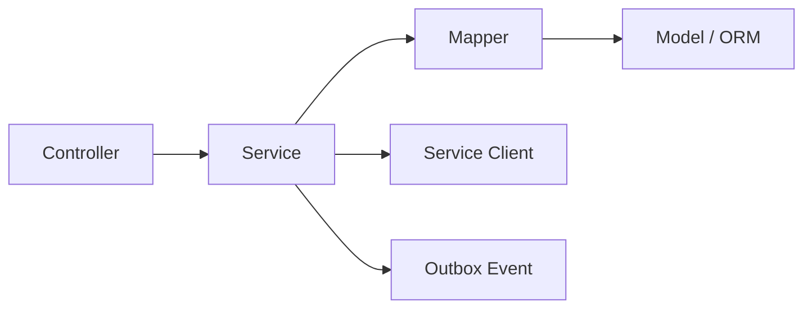

# Controller / Service / Mapper / Model 分层

## 固定调用方向



上层可以依赖下层定义的接口，下层不能反向导入上层。Controller 不直接访问数据库，Mapper
不包含业务流程，Model 不发起查询。

## 各层职责

| 层 | 应当负责 | 禁止负责 |
|---|---|---|
| Controller | 路由、HTTP 参数、鉴权依赖、请求 DTO、状态码、响应 DTO | SQL、事务、多步业务规则、跨服务编排 |
| Service | 业务校验、用例编排、事务边界、权限与状态机、调用 Mapper/Client | 解析原始 HTTP、拼 ORM 查询、返回存储层异常 |
| Mapper | 查询与写入、ORM/领域对象转换、锁与批量访问、`flush` | HTTP、产品规则、跨聚合工作流、默认提交事务 |
| Model | 表、字段、约束、关系、持久化枚举 | 查询、提交、外部调用、业务工作流 |
| Schema | 请求/响应形状和边界字段校验 | ORM 映射、数据库访问、状态迁移规则 |

本项目将传统 DAO/Repository 统一命名为 `Mapper`。Mapper 同时承担“数据访问”和“持久化
对象到领域对象的映射”，但不能把多个服务的表拼成共享 ORM 图。

## 事务规则

- Service 打开和完成业务事务；Mapper 默认只 `flush`，不自行 `commit`。
- 同一服务内强一致，必要时使用行锁、版本列和唯一约束。
- 跨服务不使用分布式事务；使用幂等 API、outbox/inbox 和补偿动作。
- Controller 捕获统一领域异常并由全局异常处理器映射为稳定错误契约。

## 依赖注入示例

```python
@router.post("/users", response_model=UserResponse, status_code=201)
def create_user(
    payload: CreateUserRequest,
    service: UserService = Depends(get_user_service),
) -> UserResponse:
    return UserResponse.model_validate(service.create_user(payload))
```

`get_user_service` 负责组装 session、Mapper 和跨服务 Client。测试时替换接口实现，不在
Controller 内临时创建数据库连接。

## 公共包边界

`backend/packages/safescan-common` 只允许包含：

- correlation/request ID、结构化日志字段；
- 标准错误响应和分页协议；
- 服务间鉴权上下文；
- UUID/public ID 等纯技术能力；
- outbox/inbox 基础接口和测试工具。

以下内容必须留在数据所有者服务：业务 ORM、权限规则、房源/租约/工单状态、Prompt、
报告领域对象和任何业务 Service。
