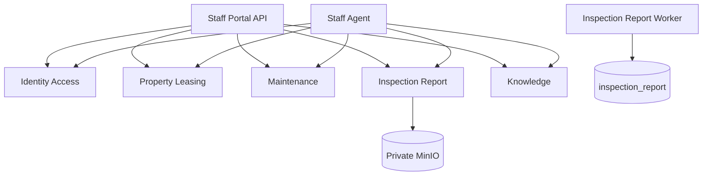

# 微服务与数据所有权

## 从数据结构倒推的边界

`backend/app/persistence/target_schema.py` 与 `docs/DATABASE-DESIGN.md` 已定义六个 PostgreSQL
schema。schema 是服务数据所有权的硬边界；Portal API 不持有业务表，Worker 复用所属服务
的数据。

| 部署单元 | 数据所有权 | 主要职责 | 同步依赖 |
|---|---|---|---|
| `staff-portal-api` | 无 | 员工页面 API 聚合和响应投影 | 身份、房源租赁、维修、检查报告、知识 |
| `tenant-portal-api` | 无 | 租客/潜客页面 API 聚合和响应投影 | 身份、房源租赁、维修、检查报告、知识 |
| `identity-access-service` | `identity_access` | 账号、凭据、员工、客户状态、RBAC、令牌 | 无业务服务硬依赖 |
| `property-leasing-service` | `property_leasing` | 大楼、房源、潜客、租约、账单、支付、看房 | 身份主体校验 |
| `maintenance-service` | `maintenance` | 工单、事件、草稿、审批 | 身份、房源、报告最小投影 |
| `inspection-report-service` | `inspection_report` | 检查、上传、视频分析、报告、PDF、对象元数据 | 身份、房源、对象存储、模型服务 |
| `inspection-report-worker` | 复用 `inspection_report` | 领取报告任务、视频分析、PDF 和清理 | 检查报告服务基础设施 |
| `knowledge-service` | `knowledge` | 知识库、角色 ACL、文档和检索 | 身份角色上下文、对象存储 |
| `staff-agent-service` | `staff_agent` | 员工会话、意图、任务、工具调用、A2A 和审计 | 所有领域服务的受控 API |

`tenant-agent-service` 由另一服务边界负责，首期不拥有本仓库六个 schema 中的任何表；它
只能通过公开契约调用领域服务。

## 依赖原则

- Portal 与 Agent 是并行入口，Agent 不是普通页面功能的必经层。
- 身份令牌提供 subject、audience 和 scope；领域服务仍需做资源级授权。
- 跨服务 ID 使用不可枚举 public UUID，不建立跨 schema 外键。
- 一个服务可以缓存其他服务的只读投影，但不能把缓存当作业务真相。
- 同步调用设置短超时；可重试写请求必须携带幂等键。
- 可靠业务事件使用 outbox/inbox，消费者以 event ID 幂等。

## 拆分顺序

1. 公共协议与测试工具。
2. `identity-access-service`，先稳定服务身份与鉴权上下文。
3. `inspection-report-service` 及其 Worker，承接当前核心可运行功能。
4. `knowledge-service`。
5. `property-leasing-service`。
6. `maintenance-service`。
7. `staff-agent-service`。
8. 最后把页面聚合从当前 FastAPI 入口收敛到两个 Portal API。

每一步都以“旧路径停止写入、契约测试通过、新服务健康检查通过”为切换条件。
